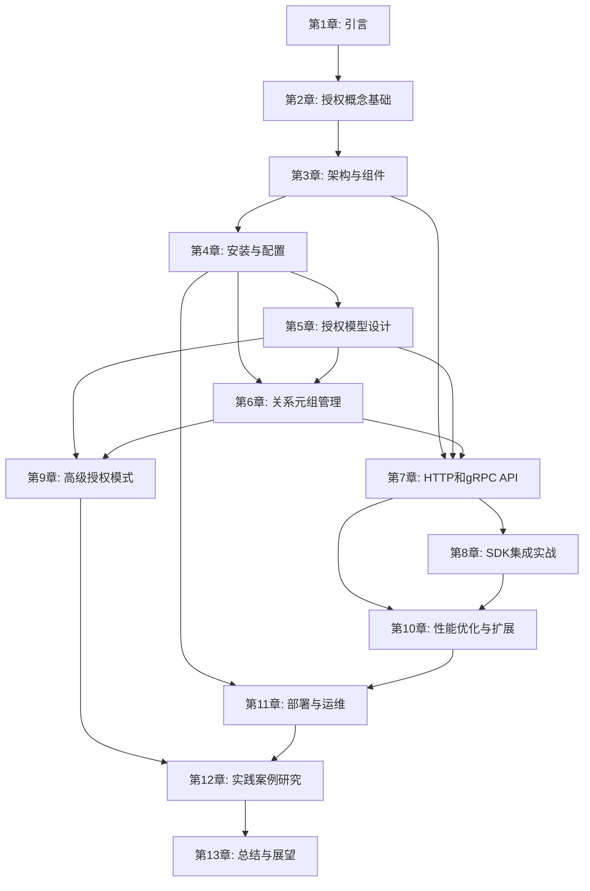

# 第 1 章：引言

> 构建可扩展的授权系统：从理念到实践

在数字化时代，应用程序的安全性和访问控制已经成为系统设计的核心考量。随着应用复杂度的不断增长，传统的授权方法往往难以满足细粒度的访问控制需求。OpenFGA 应运而生，为开发者提供了一个高性能、灵活且易于扩展的授权解决方案。本章将带领读者了解现代授权系统面临的挑战，探索 OpenFGA 的起源与发展，并明确本书的学习路径。

## 章节概述

本章是全书的开篇，旨在帮助读者理解：

- 现代应用授权系统面临的挑战与需求
- OpenFGA 的背景与起源（Google Zanzibar 的启发）
- OpenFGA 的核心价值与优势
- 本书的目标和读者收益
- 本书的组织结构和阅读建议
- 技术栈和工具要求概述

**学习目标：**

1. 理解为什么现代应用需要更好的授权系统
2. 了解 OpenFGA 的历史背景和技术渊源
3. 明确学习本书的目标和预期收获
4. 了解阅读本书需要具备的基础知识

**预计字数：** 6000-8000 字

---

## 1.1 现代应用授权系统的挑战与需求

在当今快速发展的技术环境中，应用程序的规模和复杂度都在急剧增长。无论是企业级 SaaS 平台、微服务架构，还是云原生应用，都面临着越来越复杂的授权需求。传统的授权方法已经无法满足这些挑战，开发者迫切需要一种更加灵活、可扩展的授权解决方案。

### 1.1.1 授权系统的重要性

授权（Authorization）是信息系统安全的核心支柱之一，它与认证（Authentication）共同构成了访问控制的基础。认证解决的是"你是谁"的问题，而授权解决的是"你能做什么"的问题。在一个完整的系统中，用户必须先通过认证确认身份，然后系统通过授权机制决定用户可以访问哪些资源，执行哪些操作。

**授权系统的重要性主要体现在以下几个方面：**

1. **安全保护**：有效的授权系统能够保护敏感数据和关键资源，防止未授权访问导致的数据泄露或系统破坏。根据 [OWASP Top 10](https://owasp.org/www-project-top-ten/) 安全风险列表，权限控制不当是导致安全漏洞的主要原因之一。

2. **合规要求**：许多行业法规（如 GDPR、HIPAA、SOC 2）都要求组织实现细粒度的访问控制和审计追踪。良好的授权系统能够帮助企业满足这些合规要求。

3. **业务灵活性**：现代业务场景复杂多样，需要支持多租户、层级权限、动态权限等复杂授权模式。灵活的授权系统能够快速响应业务变化，降低开发和维护成本。

4. **用户体验**：合理的授权机制能够在保证安全的前提下，为用户提供流畅的使用体验，避免因权限问题导致的频繁拒绝访问。

### 1.1.2 现代应用面临的授权挑战

随着应用架构的演进和业务复杂度的提升，开发者在使用传统授权方法时遇到了诸多挑战：

#### 代码耦合问题

传统的授权实现通常将授权逻辑直接嵌入到应用代码中，导致授权规则与业务逻辑紧密耦合。这种做法存在以下问题：

- **难以维护**：授权规则分散在代码各处，修改授权策略需要修改大量代码
- **难以测试**：授权逻辑与业务逻辑混合，单元测试变得复杂
- **难以复用**：不同服务、不同模块之间难以共享授权逻辑

```python
# 传统方式:授权逻辑嵌入业务代码
async def delete_document(document_id: str, user_id: str):
    # 业务逻辑和授权逻辑混合
    document = await db.get_document(document_id)

    # 授权检查散布在业务逻辑中
    if document.owner_id != user_id and not user_is_admin(user_id):
        raise Exception("Unauthorized")

    # 更多授权检查...
    if user_id not in document.team_members:
        raise Exception("Unauthorized")

    # 业务逻辑继续...
    await db.delete_document(document_id)
```

> **代码说明:**
>
> - **问题分析**:这种传统的授权实现存在多个缺陷
> - **代码耦合**:授权逻辑(`if`语句检查)与业务逻辑(`deleteDocument`)紧密耦合,难以独立测试和维护
> - **难以扩展**:当需要添加新的授权规则时(如团队角色、部门权限),必须修改业务代码
> - **无法复用**:不同的操作(如编辑文档、查看文档)都需要重复实现类似的授权逻辑
> - **可读性差**:业务逻辑被授权检查打断,难以理解整体业务流程

**使用 OpenFGA 的改进方案:**

```python
# OpenFGA 方式:授权逻辑分离
async def delete_document(document_id: str, user_id: str):
    # 统一的授权检查
    allowed = await fga_client.check(
        user=f"user:{user_id}",
        relation="can_delete",
        object=f"document:{document_id}"
    )

    if not allowed:
        raise Exception("Unauthorized")

    # 清晰的业务逻辑
    await db.delete_document(document_id)
```

> **改进说明:**
>
> - **关注点分离**:授权逻辑由 OpenFGA 统一管理,业务代码只需调用 `check` API
> - **易于维护**:授权规则的变更只需修改 OpenFGA 的授权模型,无需修改业务代码
> - **可复用**:所有操作都使用相同的授权检查方式,逻辑一致
> - **可读性强**:业务逻辑清晰明了,授权检查标准化

#### 扩展性限制

随着业务发展，授权需求变得越来越复杂：

- **多租户支持**：SaaS 应用需要为不同租户隔离数据和权限
- **层级权限**：组织、部门、团队的多级权限管理
- **关系型权限**：基于用户间关系的复杂权限模型（如 GitHub 的仓库协作权限）
- **动态权限**：基于时间、位置、上下文等动态条件的权限控制

传统的 RBAC（基于角色的访问控制）模型在面对这些复杂场景时显得力不从心。

#### 性能瓶颈

在高并发场景下，授权检查可能成为性能瓶颈：

- **频繁的数据库查询**：每次授权检查都需要查询数据库获取权限信息
- **分布式系统的延迟**：在微服务架构中，授权检查可能涉及多个服务间的网络调用
- **缓存策略复杂**：权限数据的缓存失效和一致性保证需要精心设计

#### 可观测性不足

传统授权系统往往缺乏足够的可观测性：

- **审计困难**：难以追踪谁在什么时候访问了什么资源
- **权限分析困难**：难以回答"用户 X 可以访问哪些资源"或"资源 Y 可以被哪些用户访问"这类问题
- **问题排查困难**：当权限出现问题时，难以快速定位原因

#### 标准化缺失

不同项目、不同团队可能采用完全不同的授权实现方式，导致：

- **学习成本高**：新成员需要学习每个项目的授权实现
- **工具重复开发**：每个项目都需要开发自己的授权工具和测试框架
- **最佳实践难以沉淀**：好的授权设计模式难以在团队间共享

这些问题促使开发者寻求更好的授权解决方案，这也为 OpenFGA 的诞生和发展提供了契机。

---

## 1.2 OpenFGA 的背景与起源

OpenFGA 的诞生并非偶然，它源于对现代授权系统需求的深刻洞察，以及对 Google Zanzibar 这一杰出设计的学习和借鉴。了解 OpenFGA 的历史背景和技术渊源，有助于我们更好地理解其设计理念和核心价值。

### 1.2.1 Google Zanzibar 的启发

Google Zanzibar 是 Google 内部使用的全球一致性授权系统，它为 Google 的数百个服务和数十亿用户提供权限检查服务。2019 年，Google 在 [Zanzibar 论文](https://zanzibar.academy/) 中详细描述了这一系统的设计理念和实现细节。

**Zanzibar 的核心设计理念包括：**

1. **关系型访问控制（ReBAC）**：基于用户与资源之间的关系来定义权限，而非传统的角色或属性
2. **全局一致性**：在分布式环境中保证授权决策的一致性
3. **高性能**：能够在毫秒级内响应授权检查请求
4. **可扩展性**：支持数万亿级别的权限关系
5. **灵活性**：能够支持多种复杂的授权模式

**Zanzibar 解决的问题：**

- **多产品权限统一**：Google 的各个产品（如 Gmail、Drive、Photos）需要共享一致的权限模型
- **复杂关系建模**：支持基于用户关系、资源关系、时间等的复杂权限规则
- **性能要求**：每天处理数万亿次权限检查请求
- **一致性保证**：在全球分布式环境中保证权限数据的一致性

Zanzibar 的成功证明了关系型访问控制（ReBAC）模型在解决复杂授权问题方面的有效性。然而，作为 Google 的内部系统，Zanzibar 并不对外开源。这促使 Auth0（现为 Okta）团队思考：能否基于类似的理念，为更广泛的开发者社区提供一个开源的授权解决方案？

### 1.2.2 OpenFGA 的发展历程

OpenFGA 项目由 Auth0 FGA（Fine-Grained Authorization）团队创建，该项目最初作为 Auth0 FGA 产品的开源版本。团队的目标是将 Google Zanzibar 的设计理念应用到开源领域，为开发者提供一个高性能、灵活的授权系统。

**关键时间节点：**

1. **2022 年 5 月**：OpenFGA 项目在 GitHub 上正式开源发布，标志着这一授权系统正式面向开源社区。项目一经发布，就受到了开发者社区的广泛关注，其受 Zanzibar 启发的关系型访问控制理念为授权系统设计带来了新的思路

2. **2022 年 9 月 14 日**：OpenFGA 被 [Cloud Native Computing Foundation (CNCF)](https://www.cncf.io/projects/openfga/) 接纳为沙箱（Sandbox）项目，这是 OpenFGA 在云原生生态系统中迈出的重要一步。CNCF 的接纳标志着 OpenFGA 得到了云原生社区的认可

3. **2024 年 10 月 28 日**：OpenFGA 从沙箱项目晋升为 CNCF 孵化级（Incubating）项目，这标志着 OpenFGA 在技术成熟度、社区活跃度和企业采用度方面达到了新的高度。晋升到孵化级别，意味着 OpenFGA 已经在生产环境中得到了广泛验证，并拥有活跃的开发社区

**注：** CNCF 项目的成熟度分为三个级别：沙箱（Sandbox）、孵化（Incubating）和毕业（Graduated）。从沙箱晋升到孵化级别，需要满足严格的技术和社区标准，包括稳定的版本发布、活跃的社区贡献、企业级采用案例等。OpenFGA 的晋升证明了其技术方案的成熟性和在实际项目中的可靠性。

CNCF 的接纳和晋升，标志着 OpenFGA 在云原生生态系统中的地位得到了认可。作为 CNCF 的项目，OpenFGA 遵循云原生最佳实践，支持容器化部署、Kubernetes 集成，并与其他 CNCF 项目（如 OpenTelemetry）深度集成。

**OpenFGA 与 Zanzibar 的关系：**

OpenFGA 并非 Zanzibar 的直接移植，而是在深入理解 Zanzibar 设计理念的基础上，结合开源社区的需求和最佳实践，重新设计和实现的授权系统。OpenFGA 在保持 Zanzibar 核心思想的同时，针对开源场景进行了优化：

- **保持核心理念**：继承了 Zanzibar 的关系型访问控制（ReBAC）思想，使用关系元组（Relationship Tuples）来表达权限关系
- **适配开源场景**：针对开源社区的需求进行了优化和简化，降低了使用门槛和学习成本
- **提供完整工具链**：提供了 SDK、CLI、Playground、VS Code 扩展等完整的开发工具，提升了开发体验
- **支持多种技术栈**：提供了 Java、.NET、JavaScript、Go、Python 等多种主流编程语言的 SDK，满足不同技术栈的需求
- **开放的设计**：采用开放的设计理念，支持多种存储后端，易于集成到现有系统中
- **社区驱动**：作为开源项目，OpenFGA 的发展由社区驱动，能够快速响应开发者的需求

OpenFGA 的发展历程体现了开源社区的力量：通过学习和借鉴优秀的设计理念，将其转化为更易用的开源解决方案，从而让更多开发者受益。

---

## 1.3 OpenFGA 的核心价值与优势

OpenFGA 的设计目标是为开发者提供一个高性能、灵活且易于扩展的授权解决方案。通过将授权逻辑从应用代码中分离出来，OpenFGA 帮助开发者实现了授权系统的现代化升级。

### 1.3.1 核心价值

根据 [OpenFGA 官方文档](https://openfga.dev/docs/fga)，OpenFGA 为开发者提供了以下核心价值：

#### 1. 将授权逻辑从应用代码中分离

**传统方式的问题：**

- 授权规则散布在业务代码各处，难以统一管理
- 修改授权策略需要修改代码并重新部署
- 难以进行授权规则的回溯和审计

**OpenFGA 的解决方案：**
OpenFGA 将授权逻辑集中管理，开发者通过声明式的授权模型（Authorization Model）定义权限规则，通过关系元组（Relationship Tuple）管理权限数据。授权模型使用简洁的 DSL（领域特定语言）定义，清晰地表达了类型（Type）和关系（Relation）的定义。这种分离设计带来以下好处：

- **易于维护**：授权规则集中在一个模型中，修改授权策略只需更新模型，无需修改业务代码
- **易于审计**：所有授权决策都有完整的日志记录，便于追踪和审计
- **易于测试**：授权模型可以独立测试，不依赖业务代码。OpenFGA 提供了 CLI 工具和 Playground 来测试授权模型
- **版本管理**：授权模型支持版本化，可以追踪模型的变化历史
- **声明式设计**：使用声明式的 DSL 定义授权模型，比命令式代码更易理解和维护

#### 2. 标准化授权解决方案

OpenFGA 提供了一个统一的授权解决方案，适用于不同的应用场景：

- **统一标准**：不同项目和团队使用相同的授权框架
- **降低学习成本**：开发者只需学习一次 OpenFGA，就能应用到多个项目
- **工具链完整**：提供了 CLI、Playground、SDK 等完整工具

#### 3. 集中化授权决策和审计日志

在微服务架构中，多个服务可能都需要进行授权检查。OpenFGA 提供了集中化的授权服务，通过统一的 API 接口（HTTP RESTful API 和 gRPC API）提供服务，带来以下优势：

- **统一授权决策**：所有服务使用相同的授权逻辑，确保授权决策的一致性
- **集中审计**：所有授权决策都记录在一个地方，便于合规和审计。OpenFGA 提供了完整的审计日志，记录每次授权检查的详细信息
- **简化合规**：满足 GDPR、HIPAA、SOC 2 等合规要求更加简单。集中化的授权服务使得合规审计变得更加容易
- **API 标准化**：提供了标准的 HTTP 和 gRPC API，易于集成到各种应用和服务中

#### 4. 简化授权策略演进

业务需求会不断变化，授权策略也需要随之演进。OpenFGA 的模型设计使得授权策略的演进变得更加简单：

- **模型版本化**：支持授权模型的版本管理
- **向后兼容**：新模型可以兼容旧的关系元组
- **平滑迁移**：提供了模型迁移的工具和方法

### 1.3.2 技术优势

除了核心价值，OpenFGA 在技术实现上也具有显著优势：

#### 1. 高性能

根据 OpenFGA 的架构设计，系统能够在毫秒级别内响应授权检查请求：

- **高效的图遍历算法**：基于关系图的权限检查算法，支持快速查询。OpenFGA 采用深度优先搜索（DFS）和广度优先搜索（BFS）等算法，结合缓存机制，能够在复杂关系图中快速查找权限路径。系统使用多种优化技术，如短路计算（short-circuit）、并发子查询处理等，显著降低授权检查延迟

- **多级缓存**：内置缓存机制，减少数据库查询。OpenFGA 支持 `CachedCheckResolver` 机制，可以缓存授权检查的中间结果，避免重复计算。系统支持多级缓存策略，包括内存缓存和分布式缓存，显著提升授权检查的性能

- **批量操作支持**：提供 Batch Check API，允许在单个请求中执行多个授权检查，减少网络延迟。批量操作 API 可以并行处理多个授权请求，大幅提升系统吞吐量

- **可扩展架构**：支持水平扩展，适应高并发场景。通过分布式架构设计，OpenFGA 可以轻松扩展到处理大规模授权请求。系统采用无状态设计，支持多实例部署，可根据负载自动扩缩容

#### 2. 灵活性

OpenFGA 支持多种授权模式，可以满足不同场景的需求：

- **关系型访问控制（ReBAC）**：基于用户与资源之间的关系定义权限。这是 OpenFGA 的核心模型，能够灵活表达复杂的权限关系
- **角色型访问控制（RBAC）**：通过 OpenFGA 的关系模型实现传统的 RBAC。可以通过定义用户与角色的关系，角色与权限的关系来实现 RBAC
- **属性型访问控制（ABAC）**：通过上下文元组（Contextual Tuples）和条件关系支持 ABAC 场景。可以在授权检查时传入动态上下文信息

#### 3. 多种存储后端

OpenFGA 支持多种存储后端，适应不同的部署场景：

- **PostgreSQL**：生产环境推荐，支持高并发和复杂查询。PostgreSQL 是 OpenFGA 在生产环境中的首选存储后端
- **MySQL**：适用于已经使用 MySQL 的环境。MySQL 提供了良好的性能和可靠性
- **SQLite**：适合开发和测试环境，无需额外数据库服务。SQLite 便于快速搭建测试环境
- **内存存储**：适合测试和演示，数据不持久化。内存存储提供了最快的性能，但数据不会持久化

#### 4. 丰富的开发工具

OpenFGA 提供了完整的开发工具链，提升开发效率：

- **多语言 SDK**：支持 Java、.NET、JavaScript/TypeScript、Go、Python 等多种主流编程语言。每个 SDK 都提供了完整的 API 封装，包括 Check、ListObjects、ListUsers、Expand 等核心操作，简化了集成工作。所有 SDK 都遵循统一的 API 设计，保证了跨语言的一致性

- **命令行工具（CLI）**：OpenFGA CLI 是一个跨平台的命令行工具，支持模型的测试、导入导出、Store 管理、授权检查等操作。CLI 工具使得模型管理和测试变得简单高效，可以快速验证授权模型的正确性

- **Visual Studio Code 扩展**：提供语法高亮和模型验证功能。VS Code 扩展能够实时验证授权模型的语法和逻辑，支持模型的自动补全、错误提示等功能，大幅提升开发体验

- **Playground**：Web 界面用于模型测试和数据管理。Playground 提供了直观的界面来测试授权模型和关系元组，无需安装任何工具即可快速验证授权逻辑。用户可以在 [https://play.fga.dev/](https://play.fga.dev/) 在线使用 Playground

- **GitHub Actions**：支持模型测试和部署的 CI/CD 集成。可以自动化授权模型的测试和部署流程，确保模型变更的质量和安全性

#### 5. 云原生支持

作为 CNCF 项目，OpenFGA 遵循云原生最佳实践：

- **容器化部署**：提供 Docker 镜像，支持容器化部署。Docker 镜像使得部署变得简单一致
- **Kubernetes 支持**：提供 Helm Charts，易于在 Kubernetes 上部署。Helm Charts 简化了 Kubernetes 环境中的部署和管理
- **OpenTelemetry 集成**：支持分布式追踪和监控。OpenFGA 内置了 OpenTelemetry 支持，可以轻松集成到现有的可观测性基础设施中
- **可观测性**：提供丰富的指标和日志。系统提供了详细的指标和日志，便于监控和故障排查

#### 6. 企业级特性

OpenFGA 提供了企业应用所需的各种特性：

- **多 Store 支持**：支持多个隔离的授权存储，适用于多租户场景。每个 Store 都有独立的授权模型和关系元组，实现了数据隔离
- **不可变模型**：授权模型创建后不可修改，保证一致性。模型版本化确保了授权策略的一致性和可追溯性
- **批量操作**：支持批量写入和查询，提高性能。批量操作 API 可以显著提升大量数据操作的效率
- **关系继承**：支持复杂的关系继承和组合。通过 `or`、`and`、`but not` 等操作符，可以定义复杂的关系继承逻辑
- **API 认证**：支持多种认证方式，包括 OAuth 2.0、API Token 等，确保 API 访问的安全性

### 1.3.3 OpenFGA 的实际应用场景

OpenFGA 已经在多个领域和场景中得到了成功应用，以下是一些典型的应用案例：

#### 1. 文档协作平台

类似 Google Docs 的文档协作系统需要实现复杂的权限管理：

- **层级权限**：文档可以组织在文件夹和驱动器中，权限可以从父级继承
- **多种角色**：支持所有者(owner)、编辑者(editor)、评论者(commenter)、查看者(viewer)等多种角色
- **共享管理**：支持将文档共享给特定用户、团队或公开

**OpenFGA 授权模型示例：**

```openfga
model
  schema 1.1

type user

type folder
  relations
    define parent: [folder]
    define owner: [user]
    define viewer: [user] or owner or viewer from parent

type document
  relations
    define parent: [folder]
    define owner: [user]
    define editor: [user] or owner
    define commenter: [user] or editor
    define viewer: [user] or commenter or viewer from parent
```

> **模型说明：**
>
> - **关系继承**：`viewer from parent` 表示文档继承父文件夹的查看权限
> - **角色层级**：`owner` → `editor` → `commenter` → `viewer` 形成权限层级
> - **灵活性**：通过 `or` 操作符组合多种授权路径，支持复杂的权限场景

#### 2. SaaS 多租户平台

企业级 SaaS 应用需要实现严格的多租户隔离和灵活的组织架构管理：

- **组织隔离**：每个组织的数据和权限完全隔离
- **层级结构**：支持组织(organization) → 团队(team) → 项目(project)的层级关系
- **角色管理**：不同层级有不同的管理员和成员角色

**典型的关系元组示例：**

```json
[
  { "user": "user:alice", "relation": "admin", "object": "organization:acme" },
  { "user": "user:bob", "relation": "member", "object": "team:engineering" },
  {
    "user": "team:engineering#member",
    "relation": "viewer",
    "object": "project:web-app"
  }
]
```

> **应用价值：**
>
> - **数据隔离**：通过 OpenFGA 的 Store 机制，可以为每个租户创建独立的授权存储
> - **灵活授权**：支持基于组织、团队、项目等多个层级的授权管理
> - **性能保证**：即使在大规模多租户场景下，也能保持毫秒级的授权检查响应

#### 3. API 网关授权

在微服务架构中，API 网关需要对每个请求进行快速的授权检查：

- **细粒度控制**：不同 API 端点有不同的访问权限
- **高性能要求**：授权检查必须在毫秒级完成，不能成为性能瓶颈
- **集中管理**：统一管理所有微服务的授权策略

**集成示例（Kong 网关）：**

OpenFGA 可以与 Kong API 网关集成，在请求路由前进行授权检查。通过 Kong 插件调用 OpenFGA 的 Check API，实现细粒度的 API 访问控制。

#### 4. AI Agent 授权管理

随着 AI 技术的发展，AI Agent 需要访问各种工具和资源，OpenFGA 可以为 AI Agent 提供细粒度的权限控制：

- **工具访问控制**：控制 Agent 可以调用哪些工具(如数据库查询、API 调用、文件操作)
- **数据权限管理**：限制 Agent 可以访问的数据范围
- **多 Agent 协作**：在多个 Agent 协作场景中，管理 Agent 之间的权限关系

这是本书的核心亮点之一，将在第 15 章和第 16 章详细介绍 OpenFGA 在 AI 应用中的实践方案。

---

## 1.4 本书的目标和读者收益

本书旨在为开发者提供 OpenFGA 的全面指南，从基础概念到高级应用，从理论到实践，帮助读者掌握构建可扩展授权系统的技能。

### 1.4.1 本书目标

本书的主要目标包括：

1. **系统化学习 OpenFGA**：从授权基础概念出发，系统介绍 OpenFGA 的设计理念、架构和核心功能，帮助读者建立完整的知识体系。

2. **掌握实践技能**：通过大量代码示例和实践案例，帮助读者掌握 OpenFGA 的安装、配置、模型设计、API 使用、SDK 集成等实际操作技能。

3. **理解最佳实践**：深入探讨 OpenFGA 在不同场景下的应用，包括多租户系统、微服务架构、云原生应用等，分享授权系统设计的最佳实践。

4. **解决实际问题**：通过真实的案例研究，展示如何将 OpenFGA 应用到实际项目中，解决复杂的授权问题。

5. **提升架构能力**：不仅介绍 OpenFGA 的使用，还深入探讨授权系统的设计原则和架构模式，帮助读者提升系统设计能力。

### 1.4.2 读者收益

通过阅读本书，读者将获得以下收益：

#### 技术能力提升

- **掌握现代授权技术**：理解关系型访问控制（ReBAC）模型，掌握现代授权系统设计的核心理念
- **熟练使用 OpenFGA**：能够独立完成 OpenFGA 的安装、配置、模型设计和系统集成
- **具备问题解决能力**：能够分析和设计适合不同业务场景的授权方案

#### 架构设计能力

- **理解授权架构设计**：掌握授权系统的分层架构、扩展性设计、性能优化等关键设计原则
- **具备系统思维**：能够从全局角度思考授权系统在整个应用架构中的作用和位置
- **掌握设计模式**：学习多租户、层级权限、动态权限等常见授权模式的设计方法

#### 实践经验积累

- **丰富的案例参考**：通过本书提供的多个实践案例，了解真实项目中的授权系统设计和实施过程
- **避坑指南**：了解授权系统设计中的常见问题和最佳实践，避免走弯路
- **工具使用技能**：熟练掌握 OpenFGA 的各种工具，提高开发效率

#### 职业发展机会

- **技术竞争力**：掌握前沿的授权技术，提升在技术市场的竞争力
- **项目经验**：能够承担复杂授权系统的设计和实施工作
- **技术视野**：了解云原生、微服务架构中的授权最佳实践

---

## 1.5 本书的组织结构和阅读建议

本书采用渐进式学习方法，从基础概念到高级应用，从理论到实践，帮助读者逐步掌握 OpenFGA。了解本书的结构和阅读建议，有助于读者制定合适的学习计划。

### 1.5.1 全书结构

本书分为五个部分，共十三章：

#### 第一部分：引言与授权基础（第 1-2 章）

**第 1 章：引言**

- 介绍现代应用授权系统面临的挑战
- 探索 OpenFGA 的背景与起源
- 阐述 OpenFGA 的核心价值与优势
- 明确本书的学习目标和阅读建议

**第 2 章：授权概念基础**

- 系统介绍授权的基本概念
- 深入讲解 RBAC、ABAC、ReBAC 等授权模型
- 分析传统授权系统的局限性
- 理解 OpenFGA 的关系型访问控制模型

**第一部分的作用：** 为后续学习奠定理论基础，帮助读者理解为什么需要 OpenFGA，以及它在授权生态系统中的地位。

#### 第二部分：OpenFGA 核心概念与实践（第 3-6 章）

**第 3 章：OpenFGA 架构与组件**

- 深入剖析 OpenFGA 的系统架构
- 详细介绍 Store、Authorization Model、Relationship Tuple 等核心组件
- 理解 HTTP API 和 gRPC API 的架构设计
- 掌握存储后端的选择与配置

**第 4 章：安装与配置**

- 学习 OpenFGA 的安装方法
- 掌握 Docker 和 Kubernetes 部署方式
- 了解不同环境下的配置策略
- 学习 CLI 工具的使用

**第 5 章：授权模型设计**

- 掌握类型（Type）和关系（Relation）的定义方法
- 学习编写授权模型的语法和规范
- 理解关系继承和嵌套关系的处理
- 学习常见授权模式的设计方法
- 掌握模型测试与验证工具

**第 6 章：关系元组管理**

- 深入理解关系元组的概念与结构
- 掌握关系元组的增删改查操作
- 学习批量操作和数据导入导出
- 理解上下文元组和条件关系元组的应用

**第二部分的作用：** 这是全书的核心部分，详细介绍 OpenFGA 的使用方法，读者可以边学边实践，逐步掌握 OpenFGA 的各项功能。

#### 第三部分：API 与 SDK 集成（第 7-8 章）

**第 7 章：HTTP 和 gRPC API 使用**

- 深入学习 RESTful API 和 gRPC API
- 掌握 Check API、List Objects API、List Users API 的使用
- 理解 API 认证与安全机制
- 学习错误处理与最佳实践

**第 8 章：SDK 集成实战**

- 学习各语言 SDK 的安装和配置
- 通过实际示例学习 SDK 的使用方法
- 掌握 SDK 的通用模式和最佳实践
- 学习错误处理和性能优化技巧

**第三部分的作用：** 帮助读者将 OpenFGA 集成到实际应用中，无论是通过 API 还是 SDK，都能熟练使用 OpenFGA 提供的功能。

#### 第四部分：高级应用与最佳实践（第 9-11 章）

**第 9 章：高级授权模式**

- 学习多租户系统的授权设计
- 掌握基于上下文的动态权限控制
- 理解细粒度访问控制的实现方法
- 学习复杂业务场景的建模方法

**第 10 章：性能优化与扩展**

- 掌握授权决策的性能优化策略
- 学习缓存机制的设计与实现
- 理解高可用性和扩展性架构设计
- 学习监控与故障排查方法

**第 11 章：部署与运维**

- 学习生产环境部署策略
- 掌握安全配置与合规性考虑
- 理解审计日志与合规要求
- 学习备份恢复和版本升级方法

**第四部分的作用：** 将 OpenFGA 应用到生产环境，解决实际项目中的复杂问题，确保系统的稳定性、安全性和可扩展性。

#### 第五部分：实践案例与展望（第 12-13 章）

**第 12 章：实践案例研究**

- 通过企业级 SaaS 平台案例学习多租户授权
- 通过微服务架构案例学习集中式授权
- 学习从传统 RBAC 迁移到 OpenFGA 的方法
- 了解云原生应用的授权架构设计

**第 13 章：总结与展望**

- 回顾全书核心知识点
- 了解 OpenFGA 的发展路线图
- 探讨授权系统的未来趋势
- 提供进阶学习路径建议

**第五部分的作用：** 通过真实案例加深理解，展望未来发展方向，为读者的进一步学习提供指导。

### 1.5.2 阅读路径建议

根据读者的背景和目标，我们提供以下阅读路径建议：

#### 路径一：快速入门（适合：希望快速上手 OpenFGA 的开发者）

**推荐章节：**

1. 第 1 章：引言（快速了解背景）
2. 第 3 章：OpenFGA 架构与组件（理解基本架构）
3. 第 4 章：安装与配置（快速部署）
4. 第 5 章：授权模型设计（核心内容）
5. 第 7 章：HTTP 和 gRPC API 使用（开始使用）
6. 第 8 章：SDK 集成实战（集成到项目）

**预计时间：** 1-2 周

**学习建议：**

- 边阅读边实践，每完成一章就尝试实际操作
- 重点关注第 5 章和第 8 章，这是最核心的内容
- 可以暂时跳过第 2 章和第 9-11 章的深入内容，先掌握基本使用

#### 路径二：系统学习（适合：希望全面掌握 OpenFGA 的开发者）

**推荐章节：**

- 按顺序阅读全部 13 章

**预计时间：** 4-6 周

**学习建议：**

- 按顺序阅读，确保理解每章内容
- 完成每章的实践练习
- 结合实际项目需求，思考如何应用所学知识
- 遇到问题及时查阅官方文档和相关资料

#### 路径三：深度学习（适合：系统架构师、技术专家）

**推荐章节：**

- 全部章节，重点关注第 2 章、第 9-12 章

**预计时间：** 6-8 周

**学习建议：**

- 深入理解授权概念和设计原则（第 2 章）
- 重点关注高级应用和架构设计（第 9-11 章）
- 深入研究实践案例，思考如何应用到自己的项目中（第 12 章）
- 阅读 Google Zanzibar 论文和相关学术资料
- 参与 OpenFGA 开源社区，贡献代码或文档

#### 通用学习建议

无论选择哪种阅读路径，都建议：

1. **理论与实践结合**：阅读理论的同时，务必动手实践，可以搭建测试环境进行实验
2. **循序渐进**：不要急于求成，确保理解每个概念后再继续
3. **查阅官方文档**：遇到问题时，及时查阅 [OpenFGA 官方文档](https://openfga.dev/docs/fga)
4. **参与社区**：加入 OpenFGA 的 [CNCF Slack](https://cloud-native.slack.com/) 或 GitHub 讨论区，与其他开发者交流
5. **学以致用**：尝试在自己的项目中应用 OpenFGA，解决实际授权问题

#### 章节间的依赖关系

为了帮助读者更好地规划学习路径，以下是章节间的依赖关系：



> **图 1-1：章节依赖关系图**
>
> 图中展示了本书各章节之间的依赖关系。建议按照箭头方向阅读，确保前置知识已经掌握。

---

## 1.6 技术栈和工具要求

为了更好地学习本书内容并实践 OpenFGA，读者需要掌握一些基础知识和工具。本节将详细介绍这些要求和推荐的工具。

### 1.6.1 必备知识

#### 编程语言基础

由于 OpenFGA 提供了多种语言的 SDK，读者需要至少熟悉一种编程语言。推荐的语言包括：

- **JavaScript/TypeScript**：适用于前端和后端 Node.js 应用
- **Go**：OpenFGA 的核心实现语言，适合微服务开发
- **Java**：适合企业级应用开发
- **Python**：适合数据处理和脚本开发
- **.NET/C#**：适合 Windows 平台和 ASP.NET Core 应用

**要求水平：** 至少能够阅读和理解代码，能够编写简单的程序。不需要精通，本书会提供详细的代码示例和说明。

#### 基础概念理解

- **RESTful API**：理解 HTTP 方法和状态码，能够阅读 API 文档
- **JSON 数据格式**：理解 JSON 的结构和基本操作
- **数据库基础**：了解关系型数据库的基本概念（如 PostgreSQL、MySQL）

#### 系统架构基础

- **客户端-服务器架构**：理解应用和授权服务的交互方式
- **微服务概念**：了解微服务架构的基本概念（如服务间通信、分布式系统）
- **容器化基础**：理解 Docker 的基本概念和使用方法

#### 授权概念基础

虽然本书第 2 章会详细介绍授权概念，但如果读者对以下概念有一定了解，将有助于快速上手：

- **认证（Authentication）与授权（Authorization）的区别**
- **RBAC（基于角色的访问控制）的基本概念**
- **权限检查的基本流程**

**注意：** 如果读者对上述概念不太熟悉，不用担心，本书第 2 章会详细讲解这些概念。

### 1.6.2 推荐工具

为了更好地学习和实践 OpenFGA，推荐准备以下工具：

#### 开发环境

**代码编辑器：**

- **Visual Studio Code**：推荐，支持 OpenFGA 扩展，提供语法高亮和模型验证
- **IntelliJ IDEA / PyCharm / GoLand**：适合特定语言开发
- **Vim / Emacs**：适合熟练使用命令行编辑器的开发者

**版本控制：**

- **Git**：用于代码版本管理和实验代码保存

#### 运行时环境

**Docker：**

- **Docker Desktop**：用于运行 OpenFGA 服务器和数据库
- 建议版本：最新稳定版

**数据库（可选）：**

- **PostgreSQL**：生产环境推荐，可以使用 Docker 运行
- **MySQL**：如果已使用 MySQL，可以选择此选项
- **SQLite**：轻量级选择，适合开发测试

#### 命令行工具

**OpenFGA CLI：**

- 用于管理 OpenFGA Store、测试模型、导入导出数据
- 安装方法将在第 4 章详细介绍

**HTTP 客户端（用于测试 API）：**

- **curl**：命令行 HTTP 客户端
- **HTTPie**：更友好的命令行 HTTP 客户端
- **Postman** 或 **Insomnia**：图形化 HTTP 客户端

#### 监控和调试工具（高级用户）

- **OpenTelemetry 工具**：用于分布式追踪和监控
- **Prometheus** 和 **Grafana**：用于指标收集和可视化（可选）

#### 推荐的学习环境配置

**最小配置（适合快速学习）：**

- Docker Desktop
- Visual Studio Code + OpenFGA 扩展
- 一个熟悉的编程语言环境（如 Node.js、Go、Python 等）

**完整配置（适合深入学习）：**

- 上述所有工具
- Kubernetes 环境（可以使用 Minikube 或 Docker Desktop 的 Kubernetes）
- 完整的监控和日志工具链

### 1.6.3 学习资源准备

在学习过程中，建议准备以下资源：

**官方资源：**

- [OpenFGA 官方文档](https://openfga.dev/docs/fga)：主要的参考文档
- [OpenFGA GitHub 仓库](https://github.com/openfga/openfga)：源代码和问题追踪
- [OpenFGA Playground](https://play.fga.dev/)：在线模型测试工具

**社区资源：**

- [CNCF Slack #openfga 频道](https://cloud-native.slack.com/)：社区讨论和问题解答
- [OpenFGA 博客](https://openfga.dev/blog)：最新动态和案例分享

**学习资料：**

- [Google Zanzibar 论文](https://zanzibar.academy/)：理解设计理念的原始论文
- CNCF 相关资源：了解云原生生态系统

### 1.6.4 快速检查清单

在开始学习之前，可以使用以下清单检查是否已准备好：

- [ ] 熟悉至少一种编程语言（JavaScript、Go、Java、Python、.NET 等）
- [ ] 了解 RESTful API 的基本概念
- [ ] 了解 JSON 数据格式
- [ ] 安装了 Docker Desktop（或类似工具）
- [ ] 安装了 Visual Studio Code（推荐）或其他代码编辑器
- [ ] 安装了 Git 版本控制工具
- [ ] 有稳定的网络连接（用于下载工具和查阅文档）

如果以上项目都已准备就绪，那么你就可以开始 OpenFGA 的学习之旅了！

---

## 本章小结

本章作为全书的开篇，为读者建立了学习 OpenFGA 的基础框架。我们系统地探讨了现代授权系统的挑战、OpenFGA 的起源与发展，以及其核心价值和技术优势。

**现代授权系统面临的挑战:**

我们首先分析了传统授权方法在现代应用中遇到的问题：代码耦合导致难以维护和测试，扩展性限制使得复杂场景难以支持，性能瓶颈在高并发下尤为突出，可观测性不足使得审计和问题排查困难，标准化缺失导致学习成本高和重复开发。通过代码对比示例，我们清晰地展示了传统方式与 OpenFGA 方式的区别，以及 OpenFGA 如何通过关注点分离解决这些问题。

**OpenFGA 的背景与起源:**

OpenFGA 的诞生受到 Google Zanzibar 的深刻启发。Zanzibar 作为 Google 内部的全球一致性授权系统，每天处理数万亿次权限检查请求，其关系型访问控制（ReBAC）理念为授权系统设计提供了新的方向。Auth0（现为 Okta）团队基于 Zanzibar 的设计理念，结合开源社区的需求，创建了 OpenFGA 项目。

OpenFGA 的发展历程见证了其在云原生生态系统中的成长：从 2022 年 5 月的开源发布，到同年 9 月被 CNCF 接纳为沙箱项目，再到 2024 年 10 月晋升为孵化级项目，每一步都标志着 OpenFGA 在技术成熟度和社区认可度方面的提升。CNCF 孵化级项目的身份证明了 OpenFGA 已经在生产环境中得到广泛验证，具备了企业级应用的能力。

**OpenFGA 的核心价值:**

OpenFGA 的核心价值体现在四个方面：

1. **授权逻辑分离**：通过声明式的授权模型和关系元组，将授权逻辑从应用代码中分离，使得授权规则易于维护、审计和测试

2. **标准化方案**：提供统一的授权框架和完整的工具链，降低学习成本，避免重复开发

3. **集中化管理**：通过统一的 API 接口提供授权服务，实现集中化的授权决策和审计日志，简化合规要求

4. **策略演进**：支持授权模型的版本管理和平滑迁移，使得授权策略的演进变得简单

**技术优势:**

OpenFGA 在技术实现上具有显著优势：

- **高性能**：采用高效的图遍历算法、多级缓存、批量操作和可扩展架构，能够在毫秒级响应授权检查
- **灵活性**：支持 ReBAC、RBAC、ABAC 等多种授权模式，适应不同场景需求
- **多存储后端**：支持 PostgreSQL、MySQL、SQLite、内存等多种存储方案
- **完整工具链**：提供多语言 SDK、CLI、VS Code 扩展、Playground、GitHub Actions 等完整的开发工具
- **云原生**：遵循云原生最佳实践，支持容器化部署、Kubernetes 集成、OpenTelemetry 监控
- **企业级特性**：支持多 Store、不可变模型、批量操作、关系继承等企业级功能

**实际应用场景:**

我们介绍了 OpenFGA 在四个典型场景中的应用：文档协作平台的层级权限管理、SaaS 多租户平台的组织隔离、API 网关的细粒度授权，以及 AI Agent 的权限控制。通过具体的模型示例和关系元组，读者可以直观地理解 OpenFGA 如何解决实际业务问题。

**学习路径:**

本书为不同背景的读者提供了三种学习路径：快速入门（1-2 周）、系统学习（4-6 周）和深度学习（6-8 周）。我们详细介绍了全书的五个部分共十三章的内容组织，以及章节间的依赖关系，帮助读者制定合适的学习计划。同时，我们也说明了学习本书需要具备的基础知识和推荐的工具，包括编程语言基础、开发工具、运行时环境等。

在下一章中，我们将深入探讨授权的核心概念，包括 ACL、RBAC、ABAC、ReBAC 等各种授权模型，以及传统授权系统的局限性。这将为理解 OpenFGA 的关系型访问控制模型奠定坚实的理论基础。

**下一章预告:**

第 2 章"授权概念基础"将帮助读者建立完整的授权知识体系。我们将系统地介绍认证与授权的区别、各种授权架构模式的原理和适用场景、ReBAC 模型的核心思想，以及现代授权系统的设计原则。这些知识将为深入学习 OpenFGA 提供必要的理论支持。

让我们一起开始这段探索 OpenFGA 的学习之旅，掌握构建可扩展授权系统的核心技能！

---

## 实践练习

### 基础练习

1. **思考题：授权系统难题分析**

   - 请列举 3 个你在实际项目中遇到过的授权系统难题
   - 分析每个难题的根本原因
   - 思考如果用 OpenFGA 来解决这些问题，会有什么不同

2. **概念理解题：认证与授权**

   - 用自己的话解释认证（Authentication）和授权（Authorization）的区别
   - 列出至少 3 个需要认证但不需要授权的场景
   - 列出至少 3 个需要授权的场景

3. **调研题：授权系统对比**
   - 调研至少 3 种不同的授权系统或框架（如 OAuth、Casbin、Open Policy Agent 等）
   - 对比它们的特点和适用场景
   - 分析 OpenFGA 与其他授权系统的区别

### 进阶练习

4. **调研题：Google Zanzibar 论文研读**

   - 阅读 Google Zanzibar 论文（可在 [zanzibar.academy](https://zanzibar.academy/) 获取）
   - 总结 Zanzibar 的 5 个核心设计理念
   - 分析 Zanzibar 如何解决 Google 的授权问题
   - 思考 OpenFGA 在哪些方面继承或改进了 Zanzibar 的设计

5. **分析题：传统授权系统的局限**

   - 选择一个你熟悉的应用系统（如 GitHub、Google Drive、Slack 等）
   - 分析该系统的授权机制可能面临的挑战
   - 如果使用 OpenFGA，如何重新设计其授权架构

6. **实践题：环境准备**
   - 根据本章的"技术栈和工具要求"部分，准备学习环境
   - 安装 Docker Desktop
   - 安装 Visual Studio Code 和 OpenFGA 扩展
   - 完成"快速检查清单"中的所有项目

### 挑战练习

7. **综合题：授权系统架构设计**

   - 假设你要设计一个类似 GitHub 的代码托管平台
   - 列出该平台需要支持的授权场景（至少 10 种）
   - 分析传统 RBAC 模型在处理这些场景时的局限性
   - 思考如何使用关系型访问控制（ReBAC）来解决这些问题

8. **研究题：CNCF 生态系统**
   - 研究 Cloud Native Computing Foundation（CNCF）的项目生态系统
   - 了解 OpenFGA 在 CNCF 中的定位
   - 分析 OpenFGA 与其他 CNCF 项目（如 Kubernetes、Prometheus、OpenTelemetry）的集成方式
   - 总结云原生授权系统的特点和优势

---

## 延伸阅读

### 官方资源

- **OpenFGA 官方文档**：[https://openfga.dev/docs/fga](https://openfga.dev/docs/fga)

  - 这是学习 OpenFGA 最主要的参考文档，建议在学习过程中经常查阅

- **OpenFGA GitHub 仓库**：[https://github.com/openfga/openfga](https://github.com/openfga/openfga)

  - 包含源代码、问题追踪、贡献指南等

- **OpenFGA Playground**：[https://play.fga.dev/](https://play.fga.dev/)
  - 在线测试授权模型的工具，无需安装即可使用

### 学术资源

- **Google Zanzibar 论文**：[https://zanzibar.academy/](https://zanzibar.academy/)
  - 理解 OpenFGA 设计理念的重要参考，建议有能力的读者仔细研读

### 社区资源

- **CNCF 项目页面**：[https://www.cncf.io/projects/openfga/](https://www.cncf.io/projects/openfga/)

  - 了解 OpenFGA 在 CNCF 生态系统中的地位和参与方式

- **CNCF Slack #openfga 频道**：[https://cloud-native.slack.com/](https://cloud-native.slack.com/)

  - 加入社区讨论，与其他开发者交流经验

- **OpenFGA 博客**：[https://openfga.dev/blog](https://openfga.dev/blog)
  - 最新动态、案例分享和最佳实践

### 相关技术文档

- **OWASP Top 10**：[https://owasp.org/www-project-top-ten/](https://owasp.org/www-project-top-ten/)

  - 了解应用安全风险，理解授权系统的重要性

- **云原生计算基金会**：[https://www.cncf.io/](https://www.cncf.io/)
  - 了解云原生生态系统和相关技术

### 学习建议

在阅读后续章节时，建议：

- 随时查阅 OpenFGA 官方文档，获取最新信息
- 使用 Playground 工具进行模型测试和实验
- 遇到问题时在社区寻求帮助
- 关注 OpenFGA 的更新和发布说明
