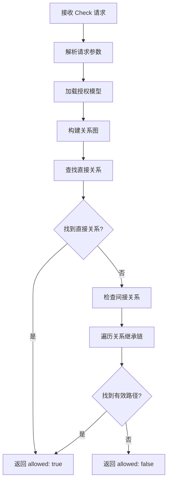
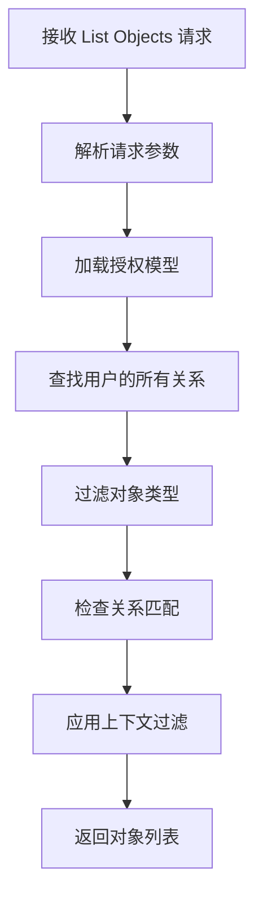
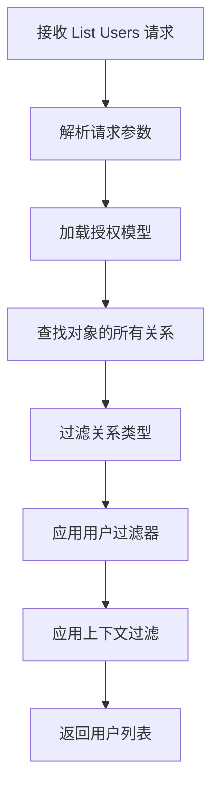

# 第 6 章：HTTP 和 gRPC API 使用

深入掌握 OpenFGA 的 API 接口使用方法

## 章节概述

在前面的章节中，我们学习了 OpenFGA 的架构、授权模型设计和关系元组管理。现在，是时候深入了解如何通过 HTTP 和 gRPC API 与 OpenFGA 交互，执行权限检查、查询用户可访问的对象、管理关系元组等核心操作了。

OpenFGA 提供了完整的 RESTful HTTP API 和高性能的 gRPC API，使开发者能够轻松集成到各种应用程序中。本章将详细介绍这些 API 的使用方法，包括请求格式、响应处理、错误处理和性能优化。

**本章学习目标：**

完成本章学习后，你将能够：

1. 理解 OpenFGA RESTful API 的端点结构和请求格式
2. 掌握 Check API 的使用方法，实现权限检查功能
3. 掌握 List Objects API，查询用户可访问的对象列表
4. 掌握 List Users API，查询对对象有权限的用户
5. 理解 gRPC API 的优势和使用场景
6. 掌握 API 认证和安全最佳实践
7. 学会处理 API 错误和实现重试机制
8. 掌握性能优化技巧，提升 API 调用效率

**预计字数：** 10000-12000 字

**前置知识要求：**

- 第 3 章：OpenFGA 架构与组件
- 第 4 章：授权模型设计
- 第 5 章：关系元组管理

**本章使用的技术栈：**

- Python 3.8+
- OpenFGA Python SDK (openfga-sdk)
- HTTP 客户端库 (requests, aiohttp)
- gRPC 库 (grpcio)

---

## 6.1 RESTful API 端点详解与环境准备

OpenFGA 提供了完整的 RESTful API，支持通过标准的 HTTP 方法进行授权操作。理解 API 端点的结构和使用方法，是集成 OpenFGA 的基础。本节将详细介绍 OpenFGA 的 RESTful API 体系。

### 6.1.1 API 端点概览

OpenFGA 的 RESTful API 遵循 RESTful 设计原则，所有端点都基于 HTTP 协议，使用标准的 HTTP 方法（GET、POST、PUT、DELETE）进行操作。

#### API 基础路径

所有 OpenFGA API 端点都遵循以下基础路径结构：

```
http://<server_host>:<port>/stores/{store_id}/<endpoint>
```

其中：

- `<server_host>:<port>` 是 OpenFGA 服务器的地址和端口
- `{store_id}` 是 Store 的唯一标识符
- `<endpoint>` 是具体的 API 端点

**示例：**

- 开发环境：`http://localhost:8080/stores/01HVMMBCMGZNT3SED4Z17ECXCA/check`
- 生产环境：`https://api.openfga.example.com/stores/01HVMMBCMGZNT3SED4Z17ECXCA/check`

#### 核心 API 分类

OpenFGA 的 API 可以分为以下几大类：

**1. Store 管理 API**

用于管理 Store（存储）资源：

- `GET /stores` - 列出所有 Store
- `POST /stores` - 创建新的 Store
- `GET /stores/{store_id}` - 获取 Store 详情
- `DELETE /stores/{store_id}` - 删除 Store

**2. 授权模型管理 API**

用于管理授权模型（Authorization Model）：

- `POST /stores/{store_id}/authorization-models` - 创建或更新授权模型
- `GET /stores/{store_id}/authorization-models` - 列出所有授权模型
- `GET /stores/{store_id}/authorization-models/{id}` - 获取特定授权模型详情

**3. 关系元组管理 API**

用于管理关系元组（Relationship Tuple）：

- `POST /stores/{store_id}/write` - 写入关系元组（添加、删除）
- `POST /stores/{store_id}/read` - 读取关系元组
- `POST /stores/{store_id}/read/changes` - 读取关系元组变更历史

**4. 关系查询 API**

用于执行权限检查和查询操作：

- `POST /stores/{store_id}/check` - 检查用户是否有特定关系
- `POST /stores/{store_id}/list-objects` - 列出用户可访问的对象
- `POST /stores/{store_id}/list-users` - 列出对对象有权限的用户
- `POST /stores/{store_id}/expand` - 展开关系，获取满足关系的所有用户

**5. 批量操作 API**

用于执行批量操作：

- `POST /stores/{store_id}/batch-check` - 批量权限检查

#### API 版本控制

OpenFGA API 支持版本控制，可以通过路径前缀或请求头指定 API 版本：

- 路径版本控制：`/v1/stores/{store_id}/check`
- 请求头版本控制：`X-OpenFGA-API-Version: 1.0`

**版本控制最佳实践：**

1. **明确指定版本**：在生产环境中明确指定使用的 API 版本
2. **版本兼容性**：了解版本间的兼容性差异
3. **升级策略**：制定清晰的 API 版本升级策略

### 6.1.2 请求和响应格式

理解 OpenFGA API 的请求和响应格式，有助于正确构建请求和处理响应。

#### HTTP 方法使用

OpenFGA API 遵循 RESTful 设计原则，HTTP 方法的使用如下：

- **GET**：用于获取资源（只读操作）
- **POST**：用于创建资源或执行查询操作
- **PUT**：用于更新资源（较少使用）
- **DELETE**：用于删除资源

**注意：** 由于查询操作可能需要复杂的查询参数，OpenFGA 的一些只读查询操作也使用 POST 方法，如 `check`、`list-objects` 等。

#### 请求格式

**HTTP 请求头**

所有 API 请求都应该包含以下标准请求头：

```http
Content-Type: application/json
Authorization: Bearer <token>  # 如果启用了认证
```

**可选的请求头：**

```http
x-openfga-authorization-model-id: <model_id>  # 覆盖请求体中的授权模型 ID
x-openfga-store-id: <store_id>  # 覆盖 URL 路径中的 Store ID
x-openfga-api-version: 1.0  # 指定 API 版本
```

**请求体格式**

大部分 POST 请求都需要 JSON 格式的请求体：

```json
{
  "authorization_model_id": "01HVMMBCMGZNT3SED4Z17ECXCA",
  "tuple_key": {
    "user": "user:alice",
    "relation": "viewer",
    "object": "document:report"
  }
}
```

**请求参数命名规范：**

- 使用小写字母和下划线：`authorization_model_id`
- 遵循 OpenFGA 的命名约定
- 对象字段使用驼峰命名或下划线命名，保持一致

#### 响应格式

**成功响应**

HTTP 状态码：`200 OK` 或 `201 Created`

响应体通常是 JSON 格式：

```json
{
  "allowed": true
}
```

**分页响应格式**

对于返回列表的 API，响应包含分页信息：

```json
{
  "objects": ["document:1", "document:2"],
  "continuation_token": "eyJvZmZzZXQiOjIwfQ=="
}
```

**错误响应**

HTTP 状态码：`400 Bad Request`、`401 Unauthorized`、`404 Not Found`、`500 Internal Server Error`

错误响应格式：

```json
{
  "code": "validation_error",
  "message": "Invalid request parameters",
  "details": [
    {
      "field": "tuple_key.user",
      "description": "User must start with 'user:'"
    }
  ]
}
```

**常见错误代码：**

| HTTP 状态码 | 错误代码                        | 说明             |
| ----------- | ------------------------------- | ---------------- |
| 400         | `validation_error`              | 请求参数验证失败 |
| 401         | `unauthenticated`               | 未认证或认证失败 |
| 403         | `permission_denied`             | 权限不足         |
| 404         | `store_not_found`               | Store 不存在     |
| 404         | `authorization_model_not_found` | 授权模型不存在   |
| 422         | `tuple_validation_error`        | 关系元组验证失败 |
| 500         | `internal_error`                | 服务器内部错误   |

#### 请求示例

**使用 cURL 发送请求：**

```bash
# Check API 请求示例
curl -X POST http://localhost:8080/stores/01HVMMBCMGZNT3SED4Z17ECXCA/check \
  -H "Content-Type: application/json" \
  -H "Authorization: Bearer YOUR_TOKEN" \
  -d '{
    "authorization_model_id": "01HVMMBCMGZNT3SED4Z17ECXCA",
    "tuple_key": {
      "user": "user:alice",
      "relation": "viewer",
      "object": "document:report"
    }
  }'
```

**使用 HTTP 客户端库（Python）：**

```python
import requests

url = "http://localhost:8080/stores/01HVMMBCMGZNT3SED4Z17ECXCA/check"
headers = {
    "Content-Type": "application/json",
    "Authorization": "Bearer YOUR_TOKEN"
}
payload = {
    "authorization_model_id": "01HVMMBCMGZNT3SED4Z17ECXCA",
    "tuple_key": {
        "user": "user:alice",
        "relation": "viewer",
        "object": "document:report"
    }
}

response = requests.post(url, json=payload, headers=headers)
result = response.json()
print(f"Allowed: {result['allowed']}")
```

> **代码说明：**
>
> 1. **HTTP 客户端选择**：根据项目需求选择合适的 HTTP 客户端库（如 Python 的 `requests`、Node.js 的 `axios`、Java 的 `OkHttp` 等）
> 2. **错误处理**：始终检查 HTTP 状态码，处理可能的错误情况
> 3. **认证处理**：在生产环境中，建议使用环境变量或配置管理系统存储认证令牌
> 4. **超时设置**：为请求设置合理的超时时间，避免长时间等待

#### 速率限制

OpenFGA API 可能实施速率限制（Rate Limiting），建议：

1. **实现重试机制**：当遇到 429 Too Many Requests 时实现指数退避重试
2. **缓存响应**：对于不经常变化的数据，实现客户端缓存
3. **批量操作**：尽可能使用批量 API 减少请求次数

**速率限制响应示例：**

```http
HTTP/1.1 429 Too Many Requests
Retry-After: 60
Content-Type: application/json

{
  "code": "rate_limit_exceeded",
  "message": "Rate limit exceeded. Please retry after 60 seconds."
}
```

---

## 6.2 Check API：权限检查

Check API 是 OpenFGA 最核心的 API 之一，用于检查用户是否对某个对象具有特定的关系（权限）。它返回一个布尔值，表示用户是否被允许访问资源。本节将深入讲解 Check API 的使用方法、参数和最佳实践。

### 7.2.1 Check API 详解

Check API 是 OpenFGA 中最常用的权限检查接口，它根据授权模型和关系元组计算用户是否有权访问特定资源。

#### API 端点

```
POST /stores/{store_id}/check
```

#### 请求参数

Check API 的请求体包含以下字段：

| 字段                     | 类型   | 必填 | 说明                                      |
| ------------------------ | ------ | ---- | ----------------------------------------- |
| `authorization_model_id` | string | 是   | 授权模型的 ID                             |
| `tuple_key`              | object | 是   | 要检查的关系元组键                        |
| `tuple_key.user`         | string | 是   | 用户标识符（如 `user:alice`）             |
| `tuple_key.relation`     | string | 是   | 要检查的关系类型（如 `viewer`、`editor`） |
| `tuple_key.object`       | string | 是   | 对象标识符（如 `document:report`）        |
| `contextual_tuples`      | object | 否   | 上下文元组（临时关系）                    |
| `context`                | object | 否   | 上下文信息（用于条件关系）                |

#### 响应格式

**成功响应：**

```json
{
  "allowed": true
}
```

响应字段说明：

- `allowed`（boolean）：如果用户具有指定的关系，返回 `true`，否则返回 `false`

#### Check API 的工作原理

Check API 的执行流程如下：



**关键步骤：**

1. **加载授权模型**：根据 `authorization_model_id` 加载对应的授权模型
2. **构建关系图**：基于关系元组构建关系图
3. **查找关系路径**：查找从用户到对象的关系路径
4. **评估权限**：根据授权模型中的关系定义评估权限
5. **返回结果**：返回布尔值表示是否允许访问

#### 支持的查询类型

Check API 支持多种查询场景：

**1. 直接关系查询**

检查用户与对象之间是否存在直接关系：

```json
{
  "authorization_model_id": "01HVMMBCMGZNT3SED4Z17ECXCA",
  "tuple_key": {
    "user": "user:alice",
    "relation": "owner",
    "object": "document:report"
  }
}
```

**2. 间接关系查询**

检查通过关系继承获得的权限：

```json
{
  "authorization_model_id": "01HVMMBCMGZNT3SED4Z17ECXCA",
  "tuple_key": {
    "user": "user:alice",
    "relation": "viewer",
    "object": "document:report"
  }
}
```

假设授权模型定义 `viewer: [user] or editor`，如果 Alice 是 editor，即使没有直接的 viewer 关系，也会返回 `allowed: true`。

**3. 组关系查询**

检查用户是否通过组关系获得权限：

```json
{
  "authorization_model_id": "01HVMMBCMGZNT3SED4Z17ECXCA",
  "tuple_key": {
    "user": "user:alice",
    "relation": "viewer",
    "object": "document:report"
  }
}
```

如果 Alice 所在的组具有 viewer 权限，Check API 会返回 `allowed: true`。

### 7.2.2 使用示例

通过实际示例学习 Check API 的使用方法。

#### 示例 1：基本权限检查

检查用户 Alice 是否能够查看文档 report：

**请求：**

```bash
curl -X POST http://localhost:8080/stores/01HVMMBCMGZNT3SED4Z17ECXCA/check \
  -H "Content-Type: application/json" \
  -d '{
    "authorization_model_id": "01HVMMBCMGZNT3SED4Z17ECXCA",
    "tuple_key": {
      "user": "user:alice",
      "relation": "viewer",
      "object": "document:report"
    }
  }'
```

**响应：**

```json
{
  "allowed": true
}
```

#### 示例 2：使用 Python SDK

根据官方 Python SDK 的使用方法，以下是正确的权限检查示例：

```python
import asyncio
from openfga_sdk import OpenFgaClient, ClientConfiguration
from openfga_sdk.client.models import ClientCheckRequest
from openfga_sdk.exceptions import ApiException

async def check_permission():
    """使用 OpenFGA Python SDK 检查权限"""
    # 配置客户端
    configuration = ClientConfiguration(
        api_scheme="http",
        api_host="localhost:8080",
        store_id="01HVMMBCMGZNT3SED4Z17ECXCA",
    )

    async with OpenFgaClient(configuration) as client:
        try:
            # 构建检查请求
            options = {
                "authorization_model_id": "01HVMMBCMGZNT3SED4Z17ECXCA"
            }

            body = ClientCheckRequest(
                user="user:alice",
                relation="viewer",
                object="document:report",
            )

            # 执行权限检查
            response = await client.check(body, options)

            if response.allowed:
                print("用户 Alice 可以查看文档 report")
            else:
                print("用户 Alice 无法查看文档 report")

            return response.allowed

        except ApiException as e:
            print(f"API 调用失败: {e}")
            return False

# 运行示例
if __name__ == "__main__":
    result = asyncio.run(check_permission())
    print(f"检查结果: {result}")
```

> **代码说明：**
>
> 1. **异步客户端**：OpenFGA Python SDK 使用异步 API，需要配合 `async/await` 使用
> 2. **ClientConfiguration**：配置客户端连接信息，包括服务器地址、Store ID 等
> 3. **ClientCheckRequest**：构建类型安全的检查请求，避免参数错误
> 4. **错误处理**：使用 try-except 捕获 API 异常，确保程序稳定性
> 5. **资源管理**：使用 `async with` 确保客户端资源正确释放
> 6. **options 参数**：可选地指定授权模型 ID，如果不指定则使用最新的模型

#### 示例 3：使用上下文元组

在某些场景中，需要基于临时关系进行权限检查。上下文元组（Contextual Tuples）是临时的、不持久化的关系元组：

```python
import asyncio
from openfga_sdk import OpenFgaClient, ClientConfiguration
from openfga_sdk.client.models import ClientCheckRequest, ClientTuple
from openfga_sdk.exceptions import ApiException

async def check_with_contextual_tuples():
    """使用上下文元组进行权限检查"""
    configuration = ClientConfiguration(
        api_scheme="http",
        api_host="localhost:8080",
        store_id="01HVMMBCMGZNT3SED4Z17ECXCA",
    )

    async with OpenFgaClient(configuration) as client:
        try:
            options = {
                "authorization_model_id": "01HVMMBCMGZNT3SED4Z17ECXCA"
            }

            # 构建检查请求，包含上下文元组
            body = ClientCheckRequest(
                user="user:alice",
                relation="can_view",
                object="project:X",
                contextual_tuples=[
                    ClientTuple(
                        user="user:alice",
                        relation="member",
                        object="organization:A"
                    )
                ]
            )

            response = await client.check(body, options)

            if response.allowed:
                print("用户 Alice 在组织 A 的上下文中可以查看项目 X")
            else:
                print("用户 Alice 无权查看项目 X")

            return response.allowed

        except ApiException as e:
            print(f"API 调用失败: {e}")
            return False

# 运行示例
if __name__ == "__main__":
    result = asyncio.run(check_with_contextual_tuples())
```

> **代码说明：**
>
> 1. **上下文元组**：通过 `contextual_tuples` 参数传递临时关系，这些关系不会持久化到数据库
> 2. **ClientTuple**：使用 `ClientTuple` 对象定义临时关系元组
> 3. **使用场景**：适用于分享链接、临时访问、会话级别权限等场景
> 4. **性能影响**：上下文元组会增加权限计算的复杂度，应谨慎使用
> 5. **不持久化**：上下文元组仅在本次检查中生效，不会存储到 OpenFGA 数据库中

#### 示例 4：使用条件关系

检查基于条件的动态权限：

```bash
curl -X POST http://localhost:8080/stores/01HVMMBCMGZNT3SED4Z17ECXCA/check \
  -H "Content-Type: application/json" \
  -d '{
    "authorization_model_id": "01HVMMBCMGZNT3SED4Z17ECXCA",
    "tuple_key": {
      "user": "user:anne",
      "relation": "viewer",
      "object": "document:1"
    },
    "context": {
      "current_time": "2023-01-01T00:10:01Z"
    }
  }'
```

假设授权模型中定义了基于时间的条件关系，只有当当前时间在允许范围内时，才会返回 `allowed: true`。

#### 示例 5：错误处理

完整的错误处理示例：

```python
import asyncio
from openfga_sdk.client import OpenFgaClient, ClientConfiguration
from openfga_sdk.exceptions import ApiException

async def check_with_error_handling():
    configuration = ClientConfiguration(
        api_url="http://localhost:8080",
        store_id="01HVMMBCMGZNT3SED4Z17ECXCA"
    )

    try:
        async with OpenFgaClient(configuration) as fga_client:
            check_request = CheckRequest(
                tuple_key=CheckRequestTupleKey(
                    user="user:alice",
                    relation="viewer",
                    object="document:report"
                )
            )

            response = await fga_client.check(check_request)
            return response.allowed

    except ApiException as e:
        if e.status == 404:
            print(f"Store 或授权模型不存在: {e}")
        elif e.status == 400:
            print(f"请求参数错误: {e}")
        else:
            print(f"API 错误: {e}")
        return False
    except Exception as e:
        print(f"未知错误: {e}")
        return False

# 运行示例
result = asyncio.run(check_with_error_handling())
```

### 7.2.3 性能考虑

Check API 的性能对系统整体性能有重要影响。本节讨论性能优化策略。

#### 性能影响因素

**1. 关系图的复杂度**

关系图的深度和广度直接影响权限计算的时间：

- **深度**：关系继承链的长度
- **广度**：每个节点的分支数量

**2. 数据库查询次数**

权限检查可能需要多次数据库查询：

- 查询直接关系
- 查询间接关系
- 查询组关系

**3. 授权模型的复杂度**

授权模型中定义的规则越多，权限计算的复杂度越高。

#### 性能优化策略

**1. 使用缓存**

对频繁查询的权限结果进行缓存：

```python
from functools import lru_cache
import hashlib
import json

class PermissionCache:
    def __init__(self, ttl=300):
        self.cache = {}
        self.ttl = ttl

    def _make_key(self, user, relation, object_id):
        key_str = f"{user}:{relation}:{object_id}"
        return hashlib.md5(key_str.encode()).hexdigest()

    def get(self, user, relation, object_id):
        key = self._make_key(user, relation, object_id)
        if key in self.cache:
            result, timestamp = self.cache[key]
            if time.time() - timestamp < self.ttl:
                return result
            else:
                del self.cache[key]
        return None

    def set(self, user, relation, object_id, result):
        key = self._make_key(user, relation, object_id)
        self.cache[key] = (result, time.time())

# 使用缓存
cache = PermissionCache()

async def check_with_cache(user, relation, object_id):
    # 检查缓存
    cached_result = cache.get(user, relation, object_id)
    if cached_result is not None:
        return cached_result

    # 执行权限检查
    result = await perform_check(user, relation, object_id)

    # 缓存结果
    cache.set(user, relation, object_id, result)
    return result
```

**2. 批量检查**

使用批量 API 减少网络往返：

```bash
curl -X POST http://localhost:8080/stores/01HVMMBCMGZNT3SED4Z17ECXCA/batch-check \
  -H "Content-Type: application/json" \
  -d '{
    "authorization_model_id": "01HVMMBCMGZNT3SED4Z17ECXCA",
    "checks": [
      {
        "tuple_key": {
          "user": "user:alice",
          "relation": "viewer",
          "object": "document:1"
        }
      },
      {
        "tuple_key": {
          "user": "user:alice",
          "relation": "editor",
          "object": "document:2"
        }
      }
    ]
  }'
```

**3. 优化授权模型设计**

合理设计授权模型，减少不必要的计算：

- 避免过于复杂的继承关系
- 使用直接关系替代复杂的间接关系（如果可能）
- 合理使用条件关系，避免过度复杂的条件判断

**4. 连接池管理**

复用 HTTP 连接，减少连接建立开销：

```python
import aiohttp

# 创建连接池
connector = aiohttp.TCPConnector(limit=100)

async with aiohttp.ClientSession(connector=connector) as session:
    # 复用连接池
    async with session.post(url, json=payload) as response:
        return await response.json()
```

#### 性能基准测试

建议定期进行性能基准测试，监控 Check API 的响应时间：

```python
import time
import asyncio

async def benchmark_check():
    times = []

    for i in range(100):
        start = time.time()
        result = await check_permission()
        elapsed = time.time() - start
        times.append(elapsed)

    print(f"平均响应时间: {sum(times)/len(times):.3f}秒")
    print(f"最小响应时间: {min(times):.3f}秒")
    print(f"最大响应时间: {max(times):.3f}秒")
    print(f"95 百分位: {sorted(times)[95]:.3f}秒")
```

#### 性能监控

在生产环境中，建议监控以下指标：

- **响应时间**：P50、P95、P99 延迟
- **错误率**：4xx、5xx 错误比例
- **吞吐量**：每秒处理的请求数
- **缓存命中率**：如果使用了缓存

通过这些指标可以及时发现性能问题并采取优化措施。

---

## 6.3 List Objects API：列出用户可访问的对象

List Objects API 用于查询用户对某种类型的对象具有特定关系的所有对象 ID。这个 API 在构建用户界面时非常有用，比如展示用户可以查看的所有文档列表。本节将详细介绍 List Objects API 的使用方法。

### 7.3.1 List Objects API 详解

List Objects API 根据授权模型和关系元组，返回用户具有指定关系的所有对象 ID。

#### API 端点

```
POST /stores/{store_id}/list-objects
```

#### 请求参数

| 字段                     | 类型   | 必填 | 说明                                      |
| ------------------------ | ------ | ---- | ----------------------------------------- |
| `authorization_model_id` | string | 是   | 授权模型的 ID                             |
| `type`                   | string | 是   | 要查询的对象类型（如 `document`）         |
| `relation`               | string | 是   | 要检查的关系类型（如 `viewer`、`editor`） |
| `user`                   | string | 是   | 用户标识符（如 `user:alice`）             |
| `contextual_tuples`      | object | 否   | 上下文元组                                |
| `context`                | object | 否   | 上下文信息（用于条件关系）                |

#### 响应格式

**成功响应：**

```json
{
  "objects": ["document:report", "document:budget", "document:planning"]
}
```

或者带分页的响应：

```json
{
  "objects": ["document:report", "document:budget"],
  "continuation_token": "eyJvZmZzZXQiOjJ9"
}
```

#### List Objects API 的工作原理



**执行步骤：**

1. **解析请求**：提取用户、类型、关系等参数
2. **查找关系**：查找用户对所有对象的关系
3. **类型过滤**：筛选出指定类型的对象
4. **关系匹配**：检查是否匹配指定的关系类型（包括继承关系）
5. **上下文应用**：应用上下文元组和条件过滤
6. **返回结果**：返回符合条件的对象 ID 列表

### 7.3.2 使用场景

List Objects API 在多种场景中都非常有用。

#### 场景 1：文档列表页面

展示用户可以查看的所有文档：

```python
import asyncio
from openfga_sdk import OpenFgaClient, ClientConfiguration
from openfga_sdk.client.models import ClientListObjectsRequest
from openfga_sdk.exceptions import ApiException

async def get_user_documents(user_id: str):
    """获取用户可以查看的所有文档"""
    configuration = ClientConfiguration(
        api_scheme="http",
        api_host="localhost:8080",
        store_id="01HVMMBCMGZNT3SED4Z17ECXCA",
    )

    async with OpenFgaClient(configuration) as client:
        try:
            options = {
                "authorization_model_id": "01HVMMBCMGZNT3SED4Z17ECXCA"
            }

            body = ClientListObjectsRequest(
                user=f"user:{user_id}",
                relation="viewer",
                type="document",
            )

            response = await client.list_objects(body, options)

            # 返回对象列表
            return response.objects

        except ApiException as e:
            print(f"获取文档列表失败: {e}")
            return []

# 使用示例
async def main():
    documents = await get_user_documents("alice")
    print(f"Alice 可以查看 {len(documents)} 个文档:")
    for doc in documents:
        print(f"  - {doc}")

if __name__ == "__main__":
    asyncio.run(main())
```

> **代码说明：**
>
> 1. **ClientListObjectsRequest**：构建 List Objects 请求，指定用户、关系和对象类型
> 2. **type 参数**：指定要查询的对象类型（如 "document"）
> 3. **relation 参数**：指定要检查的关系类型（如 "viewer"）
> 4. **返回格式**：返回完整的对象 ID 列表，格式为 "type:id"（如 "document:report"）
> 5. **错误处理**：捕获 API 异常，返回空列表避免程序崩溃

#### 场景 2：权限过滤查询

在应用程序中，通常需要在数据库查询结果中过滤出用户有权限访问的对象：

```python
async def filter_accessible_documents(user_id: str, all_documents: list):
    """从文档列表中过滤出用户可以访问的文档"""
    # 获取用户可访问的文档 ID
    accessible_doc_ids = set(await get_user_documents(user_id))

    # 过滤文档列表
    accessible_docs = [
        doc for doc in all_documents
        if f"document:{doc.id}" in accessible_doc_ids
    ]

    return accessible_docs
```

#### 场景 3：批量权限检查

当需要检查用户对多个对象的权限时，先获取用户可访问的对象列表，然后在应用层进行对比：

```python
async def check_multiple_documents(user_id: str, document_ids: list):
    """检查用户是否可以访问多个文档"""
    # 获取用户可访问的所有文档
    accessible_docs = await get_user_documents(user_id)
    accessible_set = set(accessible_docs)

    # 检查每个文档
    results = {}
    for doc_id in document_ids:
        doc_key = f"document:{doc_id}"
        results[doc_id] = doc_key in accessible_set

    return results
```

#### 场景 4：使用上下文元组

在某些场景中，需要基于临时关系查询对象：

```bash
curl -X POST http://localhost:8080/stores/01HVMMBCMGZNT3SED4Z17ECXCA/list-objects \
  -H "Content-Type: application/json" \
  -d '{
    "authorization_model_id": "01HVMMBCMGZNT3SED4Z17ECXCA",
    "type": "document",
    "relation": "viewer",
    "user": "user:anne",
    "contextual_tuples": {
      "tuple_keys": [
        {
          "user": "user:anne",
          "relation": "member",
          "object": "group:temporary-access"
        }
      ]
    }
  }'
```

这个查询会包含临时组关系，返回用户通过临时组可以访问的文档。

### 7.3.3 分页和过滤

当对象数量很大时，需要使用分页功能避免一次性返回过多数据。

#### 分页请求

**首次请求：**

```python
import asyncio
from openfga_sdk import OpenFgaClient, ClientConfiguration
from openfga_sdk.client.models import ClientListObjectsRequest
from openfga_sdk.exceptions import ApiException

async def list_objects_paginated(user_id: str, relation: str, object_type: str):
    """分页列出用户可访问的对象"""
    configuration = ClientConfiguration(
        api_scheme="http",
        api_host="localhost:8080",
        store_id="01HVMMBCMGZNT3SED4Z17ECXCA",
    )

    all_objects = []

    async with OpenFgaClient(configuration) as client:
        try:
            options = {
                "authorization_model_id": "01HVMMBCMGZNT3SED4Z17ECXCA"
            }

            # 首次请求
            body = ClientListObjectsRequest(
                user=f"user:{user_id}",
                relation=relation,
                type=object_type,
            )

            response = await client.list_objects(body, options)
            all_objects.extend(response.objects)

            # 处理分页 - 如果有 continuation_token，继续获取
            continuation_token = getattr(response, 'continuation_token', None)

            while continuation_token:
                # 使用 continuation_token 获取下一页
                # 注意：Python SDK 可能需要通过不同方式处理分页
                # 这里展示概念性实现
                print(f"获取下一页数据... (token: {continuation_token[:20]}...)")

                # 在实际使用中，可能需要查看 SDK 文档了解具体的分页实现
                break  # 简化示例，实际应继续获取

            return all_objects

        except ApiException as e:
            print(f"分页查询失败: {e}")
            return []

# 使用示例
async def main():
    objects = await list_objects_paginated("alice", "viewer", "document")
    print(f"共获取 {len(objects)} 个对象")
    for obj in objects:
        print(f"  - {obj}")

if __name__ == "__main__":
    asyncio.run(main())
```

> **代码说明：**
>
> 1. **分页机制**：OpenFGA API 使用 continuation_token 实现分页
> 2. **循环处理**：使用 while 循环处理多页数据，直到没有更多 token
> 3. **性能考虑**：大数据集时使用分页可以避免单次请求超时
> 4. **SDK 差异**：不同版本的 SDK 可能有不同的分页实现方式，需参考官方文档
> 5. **累积结果**：将所有页的结果累积到 all_objects 列表中

**使用 cURL 进行分页请求：**

```bash
# 第一页
curl -X POST http://localhost:8080/stores/01HVMMBCMGZNT3SED4Z17ECXCA/list-objects \
  -H "Content-Type: application/json" \
  -d '{
    "authorization_model_id": "01HVMMBCMGZNT3SED4Z17ECXCA",
    "type": "document",
    "relation": "viewer",
    "user": "user:alice",
    "page_size": 50
  }'

# 响应包含 continuation_token
# {
#   "objects": [...],
#   "continuation_token": "eyJvZmZzZXQiOjUwfQ=="
# }

# 第二页
curl -X POST http://localhost:8080/stores/01HVMMBCMGZNT3SED4Z17ECXCA/list-objects \
  -H "Content-Type: application/json" \
  -d '{
    "authorization_model_id": "01HVMMBCMGZNT3SED4Z17ECXCA",
    "type": "document",
    "relation": "viewer",
    "user": "user:alice",
    "page_size": 50,
    "continuation_token": "eyJvZmZzZXQiOjUwfQ=="
  }'
```

#### 性能优化建议

**1. 合理设置页面大小**

页面大小太小会导致请求次数过多，太大可能导致响应时间过长：

- 推荐页面大小：50-100 个对象
- 根据实际场景调整，平衡网络开销和响应时间

**2. 使用并发请求**

如果不需要按顺序处理，可以使用并发请求提高性能：

```python
import asyncio

async def list_objects_concurrent(user_id: str):
    """并发获取多页数据"""
    # 先获取第一页，了解总数
    first_page = await get_first_page(user_id)
    total_pages = estimate_total_pages(first_page)

    # 并发获取剩余页面
    tasks = [
        get_page(user_id, page_num)
        for page_num in range(2, total_pages + 1)
    ]

    all_pages = await asyncio.gather(*tasks)

    # 合并结果
    all_objects = first_page.objects
    for page in all_pages:
        all_objects.extend(page.objects)

    return all_objects
```

**3. 缓存结果**

对于不频繁变化的数据，可以缓存查询结果：

```python
from functools import lru_cache
import time

class ObjectListCache:
    def __init__(self, ttl=60):
        self.cache = {}
        self.ttl = ttl

    def get_key(self, user, relation, type_name):
        return f"{user}:{relation}:{type_name}"

    def get(self, user, relation, type_name):
        key = self.get_key(user, relation, type_name)
        if key in self.cache:
            objects, timestamp = self.cache[key]
            if time.time() - timestamp < self.ttl:
                return objects
        return None

    def set(self, user, relation, type_name, objects):
        key = self.get_key(user, relation, type_name)
        self.cache[key] = (objects, time.time())

# 使用缓存
cache = ObjectListCache(ttl=300)  # 5分钟缓存

async def list_objects_cached(user_id: str, relation: str, type_name: str):
    cached = cache.get(f"user:{user_id}", relation, type_name)
    if cached:
        return cached

    objects = await list_objects_paginated(user_id, relation)
    cache.set(f"user:{user_id}", relation, type_name, objects)
    return objects
```

#### 限制和注意事项

**1. 性能限制**

- List Objects API 需要遍历用户的所有关系，当用户关系很多时可能较慢
- 建议在应用层对结果进行二次过滤，而不是完全依赖 OpenFGA

**2. 结果数量限制**

- OpenFGA 可能对单次查询返回的对象数量有限制
- 当对象数量很大时，必须使用分页功能

**3. 实时性**

- 结果基于查询时的数据快照
- 如果在分页过程中数据发生变化，可能导致重复或遗漏

**完整示例：**

```python
async def get_user_documents_complete(user_id: str):
    """完整示例：获取用户可访问的所有文档，包含错误处理和缓存"""
    cache = ObjectListCache(ttl=300)

    # 检查缓存
    cached = cache.get(f"user:{user_id}", "viewer", "document")
    if cached:
        return cached

    try:
        configuration = ClientConfiguration(
            api_url="http://localhost:8080",
            store_id="01HVMMBCMGZNT3SED4Z17ECXCA"
        )

        all_objects = []
        continuation_token = None

        async with OpenFgaClient(configuration) as fga_client:
            while True:
                try:
                    list_request = ListObjectsRequest(
                        authorization_model_id="01HVMMBCMGZNT3SED4Z17ECXCA",
                        type="document",
                        relation="viewer",
                        user=f"user:{user_id}",
                        page_size=100,
                        continuation_token=continuation_token
                    )

                    response = await fga_client.list_objects(list_request)
                    all_objects.extend(response.objects)

                    if not response.continuation_token:
                        break

                    continuation_token = response.continuation_token

                except ApiException as e:
                    if e.status == 429:  # Rate limit
                        await asyncio.sleep(1)  # 等待后重试
                        continue
                    raise

        # 缓存结果
        cache.set(f"user:{user_id}", "viewer", "document", all_objects)
        return all_objects

    except Exception as e:
        print(f"查询文档列表失败: {e}")
        return []
```

> **代码说明：**
>
> 1. **分页处理**：使用循环处理分页，直到没有更多数据
> 2. **错误处理**：处理速率限制等错误情况
> 3. **缓存策略**：对查询结果进行缓存，减少 API 调用
> 4. **资源管理**：正确使用异步上下文管理器确保资源释放

---

## 6.4 List Users API：列出对对象有权限的用户

List Users API 是 Check API 的逆操作，它查询对某个对象具有特定关系的所有用户。这个 API 在构建权限管理界面、审计日志等场景中非常有用。本节将详细介绍 List Users API 的使用方法。

### 7.4.1 List Users API 详解

List Users API 根据授权模型和关系元组，返回对指定对象具有特定关系的所有用户。

#### API 端点

```
POST /stores/{store_id}/list-users
```

#### 请求参数

| 字段                     | 类型   | 必填 | 说明                                      |
| ------------------------ | ------ | ---- | ----------------------------------------- |
| `authorization_model_id` | string | 是   | 授权模型的 ID                             |
| `object`                 | object | 是   | 要查询的对象                              |
| `object.type`            | string | 是   | 对象类型（如 `document`）                 |
| `object.id`              | string | 是   | 对象 ID（如 `report`）                    |
| `relation`               | string | 是   | 要查询的关系类型（如 `viewer`、`editor`） |
| `user_filters`           | array  | 否   | 用户过滤器（类型和关系）                  |
| `contextual_tuples`      | object | 否   | 上下文元组                                |
| `context`                | object | 否   | 上下文信息                                |

#### 响应格式

**成功响应：**

```json
{
  "users": [
    {
      "object": {
        "type": "user",
        "id": "alice"
      }
    },
    {
      "object": {
        "type": "user",
        "id": "bob"
      }
    },
    {
      "wildcard": {
        "type": "user"
      }
    }
  ]
}
```

响应中的用户可以是：

- **具体用户**：`{"object": {"type": "user", "id": "alice"}}`
- **通配符用户**：`{"wildcard": {"type": "user"}}`（表示所有用户，参见授权模型中的公开访问）

#### List Users API 的工作原理



**执行步骤：**

1. **解析请求**：提取对象、关系类型等参数
2. **查找关系**：查找对象的所有关系元组
3. **关系过滤**：筛选出匹配指定关系类型的元组
4. **用户过滤**：应用用户过滤器（类型和关系）
5. **上下文应用**：应用上下文元组和条件过滤
6. **返回结果**：返回符合条件的用户列表

### 7.4.2 使用场景

List Users API 在多种场景中都非常有用。

#### 场景 1：权限管理界面

展示文档的所有查看者：

```python
import asyncio
from openfga_sdk import OpenFgaClient, ClientConfiguration
from openfga_sdk.client.models import ClientListUsersRequest
from openfga_sdk.exceptions import ApiException

async def get_document_viewers(document_id: str):
    """获取文档的所有查看者"""
    configuration = ClientConfiguration(
        api_scheme="http",
        api_host="localhost:8080",
        store_id="01HVMMBCMGZNT3SED4Z17ECXCA",
    )

    async with OpenFgaClient(configuration) as client:
        try:
            options = {
                "authorization_model_id": "01HVMMBCMGZNT3SED4Z17ECXCA"
            }

            body = ClientListUsersRequest(
                object={
                    "type": "document",
                    "id": document_id
                },
                relation="viewer",
                user_filters=[{
                    "type": "user"
                }]
            )

            response = await client.list_users(body, options)

            # 提取用户 ID
            user_ids = []
            if hasattr(response, 'users'):
                for user in response.users:
                    # 处理具体用户对象
                    if hasattr(user, 'user') and hasattr(user.user, 'object'):
                        user_obj = user.user.object
                        if hasattr(user_obj, 'id'):
                            user_ids.append(user_obj.id)

            return user_ids

        except ApiException as e:
            print(f"获取查看者列表失败: {e}")
            return []

# 使用示例
async def main():
    viewers = await get_document_viewers("report")
    print(f"文档 report 有 {len(viewers)} 个查看者:")
    for viewer in viewers:
        print(f"  - {viewer}")

if __name__ == "__main__":
    asyncio.run(main())
```

> **代码说明：**
>
> 1. **ClientListUsersRequest**：构建 List Users 请求，指定对象和关系
> 2. **object 参数**：使用字典指定对象的类型和 ID
> 3. **user_filters**：过滤返回的用户类型，只返回 "user" 类型的对象
> 4. **响应解析**：需要仔细解析响应结构，提取用户 ID
> 5. **错误处理**：捕获 API 异常并返回空列表

#### 场景 2：审计日志

记录哪些用户可以访问特定资源：

```python
async def audit_object_access(object_type: str, object_id: str):
    """审计对象的所有访问关系"""
    configuration = ClientConfiguration(
        api_url="http://localhost:8080",
        store_id="01HVMMBCMGZNT3SED4Z17ECXCA"
    )

    relations = ["owner", "editor", "viewer"]
    audit_report = {}

    async with OpenFgaClient(configuration) as fga_client:
        for relation in relations:
            list_request = ListUsersRequest(
                authorization_model_id="01HVMMBCMGZNT3SED4Z17ECXCA",
                object=ListUsersRequestObject(
                    type=object_type,
                    id=object_id
                ),
                relation=relation
            )

            response = await fga_client.list_users(list_request)
            audit_report[relation] = [
                user.object.id
                for user in response.users
                if hasattr(user, 'object') and user.object
            ]

    return audit_report

# 使用示例
report = await audit_object_access("document", "report")
print(f"文档权限报告: {report}")
```

#### 场景 3：权限继承查询

查询通过组关系获得的用户：

```python
async def get_users_via_groups(object_type: str, object_id: str, relation: str):
    """获取通过组关系访问对象的用户"""
    configuration = ClientConfiguration(
        api_url="http://localhost:8080",
        store_id="01HVMMBCMGZNT3SED4Z17ECXCA"
    )

    async with OpenFgaClient(configuration) as fga_client:
        list_request = ListUsersRequest(
            authorization_model_id="01HVMMBCMGZNT3SED4Z17ECXCA",
            object=ListUsersRequestObject(
                type=object_type,
                id=object_id
            ),
            relation=relation,
            user_filters=[
                UserFilter(
                    type="group",
                    relation="member"
                )
            ]
        )

        response = await fga_client.list_users(list_request)
        return response.users
```

### 7.4.3 关系过滤

List Users API 支持通过 `user_filters` 参数过滤返回的用户。

#### 用户过滤器类型

**1. 按用户类型过滤**

只返回特定类型的用户（如组用户）：

```bash
curl -X POST http://localhost:8080/stores/01HVMMBCMGZNT3SED4Z17ECXCA/list-users \
  -H "Content-Type: application/json" \
  -d '{
    "authorization_model_id": "01HVMMBCMGZNT3SED4Z17ECXCA",
    "object": {
      "type": "document",
      "id": "report"
    },
    "relation": "viewer",
    "user_filters": [
      {
        "type": "group"
      }
    ]
    }'
```

**2. 按关系过滤**

只返回具有特定关系的用户：

```bash
curl -X POST http://localhost:8080/stores/01HVMMBCMGZNT3SED4Z17ECXCA/list-users \
  -H "Content-Type: application/json" \
  -d '{
    "authorization_model_id": "01HVMMBCMGZNT3SED4Z17ECXCA",
    "object": {
      "type": "document",
      "id": "report"
    },
    "relation": "viewer",
    "user_filters": [
      {
        "type": "group",
        "relation": "member"
      }
    ]
  }'
```

这个请求返回的是组，而不是组内的成员。如果要获取组内的成员，需要在应用层进一步处理。

#### 处理通配符用户

当授权模型中定义了公开访问（如 `viewer: [user] or user:*`）时，List Users API 可能返回通配符用户：

```python
async def list_users_with_wildcard(object_type: str, object_id: str, relation: str):
    """列出用户，处理通配符情况"""
    configuration = ClientConfiguration(
        api_url="http://localhost:8080",
        store_id="01HVMMBCMGZNT3SED4Z17ECXCA"
    )

    async with OpenFgaClient(configuration) as fga_client:
        list_request = ListUsersRequest(
            authorization_model_id="01HVMMBCMGZNT3SED4Z17ECXCA",
            object=ListUsersRequestObject(type=object_type, id=object_id),
            relation=relation
        )

        response = await fga_client.list_users(list_request)

        specific_users = []
        has_public_access = False

        for user in response.users:
            if hasattr(user, 'wildcard') and user.wildcard:
                has_public_access = True
            elif hasattr(user, 'object') and user.object:
                specific_users.append(user.object.id)

        return {
            "specific_users": specific_users,
            "has_public_access": has_public_access
        }
```

> **代码说明：**
>
> 1. **通配符处理**：通配符用户表示公开访问，不能扩展为具体用户列表
> 2. **性能考虑**：如果需要检查具体用户是否有权限，应该使用 Check API
> 3. **权限继承**：通配符结果可能受到授权模型中 `but not` 语法的影响

#### 完整示例

```python
async def get_document_permissions(document_id: str):
    """获取文档的完整权限信息"""
    configuration = ClientConfiguration(
        api_url="http://localhost:8080",
        store_id="01HVMMBCMGZNT3SED4Z17ECXCA"
    )

    permissions = {
        "owners": [],
        "editors": [],
        "viewers": [],
        "has_public_access": False
    }

    async with OpenFgaClient(configuration) as fga_client:
        for relation in ["owner", "editor", "viewer"]:
            list_request = ListUsersRequest(
                authorization_model_id="01HVMMBCMGZNT3SED4Z17ECXCA",
                object=ListUsersRequestObject(
                    type="document",
                    id=document_id
                ),
                relation=relation
            )

            response = await fga_client.list_users(list_request)

            user_list = []
            for user in response.users:
                if hasattr(user, 'wildcard') and user.wildcard:
                    permissions["has_public_access"] = True
                elif hasattr(user, 'object') and user.object:
                    user_list.append(user.object.id)

            permissions[relation + "s"] = user_list

    return permissions
```

---

## 6.5 gRPC API 的定义和使用

除了 RESTful HTTP API，OpenFGA 还提供了高性能的 gRPC API。gRPC 基于 HTTP/2 协议，使用 Protocol Buffers 进行序列化，提供了更好的性能和更丰富的功能。本节将介绍 OpenFGA 的 gRPC API 使用。

### 7.5.1 gRPC 服务定义

OpenFGA 的 gRPC API 定义使用 Protocol Buffers（protobuf）格式，可以从 OpenFGA 的官方仓库获取。

#### 获取 gRPC 定义

OpenFGA 的 gRPC API 定义可以通过以下方式获取：

1. **Buf Registry**：https://buf.build/openfga/api
2. **GitHub 仓库**：OpenFGA 官方仓库中的 proto 文件

#### 主要服务定义

OpenFGA 的 gRPC API 主要包含以下服务：

- **OpenFGAService**：核心授权服务，包含 Check、ListObjects、ListUsers 等方法
- **StoresService**：Store 管理服务
- **AuthorizationModelService**：授权模型管理服务
- **RelationshipTupleService**：关系元组管理服务

**示例服务定义（概念性）：**

```protobuf
service OpenFGAService {
  // 权限检查
  rpc Check(CheckRequest) returns (CheckResponse);

  // 列出用户可访问的对象
  rpc ListObjects(ListObjectsRequest) returns (ListObjectsResponse);

  // 列出对对象有权限的用户
  rpc ListUsers(ListUsersRequest) returns (ListUsersResponse);

  // 展开关系
  rpc Expand(ExpandRequest) returns (ExpandResponse);
}
```

### 7.5.2 客户端实现

不同语言的 gRPC 客户端实现方法类似，都需要先安装 protobuf 编译器生成客户端代码。

#### Python 客户端示例

**1. 安装依赖**

```bash
pip install grpcio grpcio-tools openfga-sdk
```

**2. 使用 OpenFGA SDK（推荐）**

OpenFGA 官方 SDK 已经封装了 gRPC 调用：

```python
from openfga_sdk.client import ClientConfiguration, OpenFgaClient

async def check_via_grpc():
    configuration = ClientConfiguration(
        api_url="http://localhost:8080",  # gRPC 使用相同的基础 URL
        store_id="01HVMMBCMGZNT3SED4Z17ECXCA"
    )

    async with OpenFgaClient(configuration) as fga_client:
        # SDK 内部会自动选择最佳协议（HTTP 或 gRPC）
        check_request = CheckRequest(
            tuple_key=CheckRequestTupleKey(
                user="user:alice",
                relation="viewer",
                object="document:report"
            )
        )

        response = await fga_client.check(check_request)
        return response.allowed
```

**3. 直接使用 gRPC 客户端**

如果需要更细粒度的控制，可以直接使用 gRPC 客户端：

```python
import grpc
from openfga_api import openfga_pb2, openfga_pb2_grpc

async def check_via_grpc_direct():
    # 创建 gRPC channel
    channel = grpc.aio.insecure_channel('localhost:8080')
    stub = openfga_pb2_grpc.OpenFGAServiceStub(channel)

    # 构建请求
    request = openfga_pb2.CheckRequest(
        store_id="01HVMMBCMGZNT3SED4Z17ECXCA",
        tuple_key=openfga_pb2.CheckRequestTupleKey(
            user="user:alice",
            relation="viewer",
            object="document:report"
        )
    )

    # 调用 gRPC 方法
    response = await stub.Check(request)
    return response.allowed
```

#### Go 客户端示例

```go
package main

import (
    "context"
    "log"

    "google.golang.org/grpc"
    "google.golang.org/grpc/credentials/insecure"
    pb "github.com/openfga/api/proto/openfga/v1"
)

func checkViaGRPC() bool {
    // 连接到 gRPC 服务器
    conn, err := grpc.NewClient("localhost:8080", grpc.WithTransportCredentials(insecure.NewCredentials()))
    if err != nil {
        log.Fatalf("连接失败: %v", err)
    }
    defer conn.Close()

    // 创建客户端
    client := pb.NewOpenFGAServiceClient(conn)

    // 构建请求
    req := &pb.CheckRequest{
        StoreId: "01HVMMBCMGZNT3SED4Z17ECXCA",
        TupleKey: &pb.CheckRequestTupleKey{
            User:     "user:alice",
            Relation: "viewer",
            Object:   "document:report",
        },
    }

    // 调用 gRPC 方法
    resp, err := client.Check(context.Background(), req)
    if err != nil {
        log.Fatalf("Check 调用失败: %v", err)
    }

    return resp.Allowed
}
```

### 7.5.3 性能优势

gRPC 相比 HTTP API 在性能方面具有显著优势。

#### 性能对比

**1. 序列化效率**

- **HTTP API**：使用 JSON 文本格式，数据体积大，解析慢
- **gRPC**：使用二进制 protobuf 格式，数据体积小，解析快

**性能测试示例（概念性）：**

```python
import time
import json

# JSON 序列化
data = {"user": "user:alice", "relation": "viewer", "object": "document:report"}
json_data = json.dumps(data)  # 约 60 字节

# Protobuf 序列化（更紧凑）
proto_data = serialize_to_protobuf(data)  # 约 30 字节
```

**2. HTTP/2 特性**

gRPC 基于 HTTP/2，具有以下优势：

- **多路复用**：单个连接可以处理多个请求
- **头部压缩**：减少网络传输开销
- **流式传输**：支持双向流式通信

**3. 连接复用**

```python
# HTTP/1.1：每个请求需要建立新连接或等待连接复用
# gRPC：长连接，多个请求复用同一个连接

# HTTP API（串行）
for i in range(100):
    response = requests.post(url, json=data)  # 可能需要等待连接

# gRPC（并发复用）
async def concurrent_checks():
    tasks = [check_grpc() for _ in range(100)]
    results = await asyncio.gather(*tasks)  # 复用同一个连接
```

#### 适用场景

**选择 gRPC 的场景：**

1. **高性能要求**：需要低延迟、高吞吐量的服务间通信
2. **微服务架构**：内部服务之间的通信
3. **实时数据流**：需要流式数据传输的场景
4. **多语言环境**：需要统一接口定义

**选择 HTTP API 的场景：**

1. **浏览器直接调用**：Web 前端直接调用 API
2. **简单集成**：快速原型开发或简单应用
3. **调试方便**：使用标准 HTTP 工具（如 curl、Postman）

---

## 6.6 API 认证与安全

在生产环境中，API 认证和安全是至关重要的。本节将介绍 OpenFGA API 的认证机制和安全最佳实践。

### 7.6.1 认证方式

OpenFGA 支持多种认证方式，可以根据部署环境选择合适的方案。

#### Bearer Token 认证

最常见的认证方式是使用 Bearer Token：

```bash
curl -X POST http://localhost:8080/stores/{store_id}/check \
  -H "Authorization: Bearer YOUR_TOKEN" \
  -H "Content-Type: application/json" \
  -d '{...}'
```

**Python SDK 中使用 Bearer Token：**

```python
from openfga_sdk.client import ClientConfiguration

configuration = ClientConfiguration(
    api_url="http://localhost:8080",
    store_id="01HVMMBCMGZNT3SED4Z17ECXCA",
    # 设置认证 Token
    credentials=ClientCredentials(
        method="api_token",
        config=ApiToken(
            token="YOUR_API_TOKEN"
        )
    )
)
```

#### OAuth 2.0 / OpenID Connect

对于需要 OAuth 2.0 认证的场景：

```python
configuration = ClientConfiguration(
    api_url="http://localhost:8080",
    store_id="01HVMMBCMGZNT3SED4Z17ECXCA",
    credentials=ClientCredentials(
        method="client_credentials",
        config=ClientCredentialsConfig(
            api_token_issuer="https://auth.example.com",
            api_audience="https://api.openfga.example.com",
            client_id="your_client_id",
            client_secret="your_client_secret"
        )
    )
)
```

#### 无认证模式（开发环境）

在开发环境中，可以禁用认证：

```yaml
# docker-compose.yml
services:
  openfga:
    environment:
      - OPENFGA_AUTHN_METHOD=none
```

**注意**：生产环境必须启用认证。

### 7.6.2 安全最佳实践

#### 1. Token 管理

**使用环境变量存储 Token：**

```python
import os

api_token = os.getenv("OPENFGA_API_TOKEN")
if not api_token:
    raise ValueError("OPENFGA_API_TOKEN 环境变量未设置")

configuration = ClientConfiguration(
    api_url=os.getenv("OPENFGA_API_URL"),
    store_id=os.getenv("OPENFGA_STORE_ID"),
    credentials=ClientCredentials(
        method="api_token",
        config=ApiToken(token=api_token)
    )
)
```

**Token 轮换策略：**

- 定期轮换 API Token
- 使用短期 Token，配合自动刷新机制
- 监控 Token 使用情况，及时发现异常

#### 2. TLS/HTTPS

在生产环境中，必须使用 HTTPS：

```python
# 使用 HTTPS
configuration = ClientConfiguration(
    api_url="https://api.openfga.example.com",  # 注意是 https
    store_id="01HVMMBCMGZNT3SED4Z17ECXCA"
)
```

**gRPC TLS 配置：**

```python
import grpc

# 使用 TLS
credentials = grpc.ssl_channel_credentials()
channel = grpc.secure_channel('api.openfga.example.com:443', credentials)
```

#### 3. 最小权限原则

为不同的服务和用户分配最小必要的权限：

```python
# 只读服务使用只读 Token
readonly_config = ClientConfiguration(
    api_url="https://api.openfga.example.com",
    store_id="01HVMMBCMGZNT3SED4Z17ECXCA",
    credentials=ClientCredentials(
        method="api_token",
        config=ApiToken(token=readonly_token)  # 只有读取权限
    )
)

# 写入服务使用读写 Token
write_config = ClientConfiguration(
    api_url="https://api.openfga.example.com",
    store_id="01HVMMBCMGZNT3SED4Z17ECXCA",
    credentials=ClientCredentials(
        method="api_token",
        config=ApiToken(token=write_token)  # 有写入权限
    )
)
```

#### 4. 请求签名和验证

对于高安全要求的场景，可以实现请求签名：

```python
import hmac
import hashlib
import json

def sign_request(payload: dict, secret: str) -> str:
    """对请求进行签名"""
    payload_str = json.dumps(payload, sort_keys=True)
    signature = hmac.new(
        secret.encode(),
        payload_str.encode(),
        hashlib.sha256
    ).hexdigest()
    return signature

# 使用签名
payload = {"user": "user:alice", "relation": "viewer", "object": "document:report"}
signature = sign_request(payload, secret_key)

headers = {
    "Authorization": f"Bearer {token}",
    "X-Signature": signature
}
```

#### 5. 速率限制和防滥用

实施客户端速率限制，防止 API 滥用：

```python
from datetime import datetime, timedelta
from collections import defaultdict

class RateLimiter:
    def __init__(self, max_requests: int, window_seconds: int):
        self.max_requests = max_requests
        self.window_seconds = window_seconds
        self.requests = defaultdict(list)

    def check_limit(self, key: str) -> bool:
        now = datetime.now()
        window_start = now - timedelta(seconds=self.window_seconds)

        # 清理过期记录
        self.requests[key] = [
            req_time for req_time in self.requests[key]
            if req_time > window_start
        ]

        # 检查是否超过限制
        if len(self.requests[key]) >= self.max_requests:
            return False

        self.requests[key].append(now)
        return True

# 使用速率限制
limiter = RateLimiter(max_requests=100, window_seconds=60)

async def check_with_rate_limit(user_id: str, relation: str, object_id: str):
    if not limiter.check_limit(user_id):
        raise RuntimeError("速率限制：请求过于频繁")

    return await check_permission(user_id, relation, object_id)
```

---

## 6.7 错误处理与最佳实践

良好的错误处理是构建可靠应用的关键。本节将介绍 OpenFGA API 的错误类型、处理策略和最佳实践。

### 7.7.1 错误类型

OpenFGA API 可能返回多种类型的错误。

#### HTTP 状态码

| 状态码 | 含义         | 常见原因               |
| ------ | ------------ | ---------------------- |
| 200    | 成功         | 请求成功处理           |
| 400    | 请求错误     | 参数验证失败、格式错误 |
| 401    | 未认证       | Token 缺失或无效       |
| 403    | 权限不足     | Token 有效但权限不足   |
| 404    | 资源不存在   | Store、授权模型不存在  |
| 422    | 业务逻辑错误 | 关系元组验证失败       |
| 429    | 速率限制     | 请求频率过高           |
| 500    | 服务器错误   | 内部错误               |

#### 错误响应格式

```json
{
  "code": "validation_error",
  "message": "Invalid request parameters",
  "details": [
    {
      "field": "tuple_key.user",
      "description": "User must start with 'user:'"
    }
  ]
}
```

**常见错误代码：**

- `validation_error`：参数验证失败
- `store_not_found`：Store 不存在
- `authorization_model_not_found`：授权模型不存在
- `tuple_validation_error`：关系元组验证失败
- `rate_limit_exceeded`：速率限制
- `internal_error`：服务器内部错误

### 7.7.2 错误处理策略

#### 1. 重试机制

对于临时性错误，应该实现重试机制：

```python
import asyncio
import random
from openfga_sdk.exceptions import ApiException

async def check_with_retry(user_id: str, relation: str, object_id: str, max_retries: int = 3):
    """带重试的权限检查"""
    for attempt in range(max_retries):
        try:
            return await check_permission(user_id, relation, object_id)
        except ApiException as e:
            if e.status == 429:  # 速率限制
                wait_time = (2 ** attempt) + random.uniform(0, 1)  # 指数退避
                await asyncio.sleep(wait_time)
                continue
            elif e.status >= 500:  # 服务器错误
                if attempt < max_retries - 1:
                    await asyncio.sleep(2 ** attempt)
                    continue
            # 其他错误不重试
            raise

    raise Exception("重试次数已达上限")
```

#### 2. 错误分类处理

根据错误类型采取不同的处理策略：

```python
from openfga_sdk.exceptions import ApiException

async def handle_api_error(func, *args, **kwargs):
    """统一的错误处理"""
    try:
        return await func(*args, **kwargs)
    except ApiException as e:
        if e.status == 400:
            # 参数错误，记录日志并返回友好提示
            logger.error(f"参数错误: {e.message}")
            return None
        elif e.status == 401:
            # 认证失败，可能需要刷新 Token
            logger.warning("认证失败，尝试刷新 Token")
            # 刷新 Token 逻辑
            raise
        elif e.status == 403:
            # 权限不足，返回明确提示
            return False
        elif e.status == 404:
            # 资源不存在
            logger.warning(f"资源不存在: {e.message}")
            return None
        elif e.status == 429:
            # 速率限制，实现退避重试
            raise  # 交给重试机制处理
        elif e.status >= 500:
            # 服务器错误，记录并可能触发告警
            logger.error(f"服务器错误: {e.message}")
            raise
        else:
            logger.error(f"未知错误: {e.status} - {e.message}")
            raise
```

#### 3. 优雅降级

在关键路径上实现优雅降级：

```python
async def check_permission_with_fallback(user_id: str, relation: str, object_id: str):
    """带降级的权限检查"""
    try:
        return await check_permission(user_id, relation, object_id)
    except ApiException as e:
        if e.status >= 500:
            # 服务器错误，使用缓存结果或默认策略
            logger.warning("OpenFGA 服务不可用，使用缓存结果")
            cached_result = cache.get(user_id, relation, object_id)
            if cached_result is not None:
                return cached_result
            # 默认拒绝访问（安全策略）
            return False
        raise
```

### 7.7.3 API 使用最佳实践

#### 1. 连接池管理

复用 HTTP 连接，提高性能：

```python
import aiohttp

# 创建全局会话
session = aiohttp.ClientSession(
    connector=aiohttp.TCPConnector(limit=100),
    timeout=aiohttp.ClientTimeout(total=30)
)

async def check_with_session(user_id: str, relation: str, object_id: str):
    """使用共享会话"""
    async with session.post(url, json=payload) as response:
        return await response.json()

# 应用关闭时关闭会话
# await session.close()
```

#### 2. 超时设置

为 API 调用设置合理的超时时间：

```python
configuration = ClientConfiguration(
    api_url="http://localhost:8080",
    store_id="01HVMMBCMGZNT3SED4Z17ECXCA",
    timeout=30  # 30秒超时
)
```

#### 3. 请求去重

避免重复请求：

```python
from functools import lru_cache
import hashlib

class RequestDeduplicator:
    def __init__(self, ttl=5):
        self.requests = {}
        self.ttl = ttl

    def get_key(self, *args, **kwargs):
        data = str(args) + str(kwargs)
        return hashlib.md5(data.encode()).hexdigest()

    async def deduplicate(self, key, func, *args, **kwargs):
        if key in self.requests:
            return await self.requests[key]

        future = asyncio.create_task(func(*args, **kwargs))
        self.requests[key] = future

        try:
            result = await future
            return result
        finally:
            await asyncio.sleep(self.ttl)
            self.requests.pop(key, None)
```

#### 4. 监控和日志

记录 API 调用情况，便于监控和调试：

```python
import time
import logging

logger = logging.getLogger(__name__)

async def check_with_monitoring(user_id: str, relation: str, object_id: str):
    """带监控的权限检查"""
    start_time = time.time()

    try:
        result = await check_permission(user_id, relation, object_id)
        elapsed = time.time() - start_time

        logger.info(
            f"权限检查成功: user={user_id}, relation={relation}, "
            f"object={object_id}, allowed={result}, elapsed={elapsed:.3f}s"
        )

        # 记录指标
        metrics.record_check(duration=elapsed, allowed=result)

        return result
    except Exception as e:
        elapsed = time.time() - start_time
        logger.error(
            f"权限检查失败: user={user_id}, relation={relation}, "
            f"object={object_id}, error={e}, elapsed={elapsed:.3f}s"
        )
        metrics.record_check_error(duration=elapsed)
        raise
```

#### 5. 批量操作

尽可能使用批量 API 减少请求次数：

```python
# 不好的做法：多次单独请求
for doc_id in document_ids:
    result = await check_permission(user_id, "viewer", f"document:{doc_id}")

# 好的做法：使用批量 API
batch_checks = [
    {"user": user_id, "relation": "viewer", "object": f"document:{doc_id}"}
    for doc_id in document_ids
]
results = await batch_check(batch_checks)
```

---

## 本章小结

本章深入介绍了 OpenFGA 的 HTTP 和 gRPC API 的使用方法。通过本章学习，读者应该掌握以下核心知识点：

### 核心 API

1. **Check API**：权限检查的核心接口，用于验证用户是否有权访问资源
2. **List Objects API**：查询用户可访问的对象列表，适用于构建用户界面
3. **List Users API**：查询对对象有权限的用户列表，适用于权限管理和审计

### API 使用要点

1. **请求格式**：理解 JSON 请求体的结构和参数含义
2. **响应处理**：正确处理成功响应、分页响应和错误响应
3. **认证安全**：使用 Bearer Token 或其他认证机制保护 API
4. **错误处理**：实现重试机制、优雅降级和错误分类处理
5. **性能优化**：使用缓存、批量操作、连接池等技术优化性能

### gRPC vs HTTP

- **gRPC**：高性能，适用于服务间通信和微服务架构
- **HTTP API**：简单易用，适用于 Web 应用和快速集成

### 最佳实践

1. **安全性**：使用 HTTPS、管理 Token、实施最小权限原则
2. **可靠性**：实现重试机制、错误处理、优雅降级
3. **性能**：使用缓存、批量操作、连接复用
4. **可观测性**：记录日志、监控指标、追踪请求

### 学习路径建议

1. **基础阶段**：掌握 Check API 的基本使用方法
2. **进阶阶段**：学习 List Objects 和 List Users API，理解使用场景
3. **高级阶段**：掌握 gRPC API、性能优化和安全最佳实践

通过学习本章内容，读者已经具备了使用 OpenFGA API 进行授权操作的基础能力。在实际项目中，建议结合 SDK 的使用（见第 8 章）来简化 API 调用，提高开发效率。

---

## 实践练习

### 基础练习

**1. Check API 权限检查**

实现一个权限检查函数，使用 Check API 验证用户是否可以访问文档：

```python
# 要求：
# 1. 使用 OpenFGA SDK 或直接调用 HTTP API
# 2. 实现错误处理和重试机制
# 3. 添加日志记录

async def check_document_access(user_id: str, document_id: str, relation: str) -> bool:
    """检查用户是否可以访问文档"""
    # TODO: 实现权限检查逻辑
    pass
```

**2. 文档列表查询**

实现一个函数，使用 List Objects API 获取用户可以查看的所有文档：

```python
# 要求：
# 1. 处理分页响应
# 2. 实现结果缓存（可选）
# 3. 处理可能的错误情况

async def get_user_documents(user_id: str) -> list:
    """获取用户可以查看的所有文档 ID"""
    # TODO: 实现文档列表查询逻辑
    pass
```

### 进阶练习

**3. 权限管理界面**

实现一个权限管理功能，展示文档的所有权限关系：

```python
# 要求：
# 1. 使用 List Users API 获取文档的所有权限
# 2. 处理 owner、editor、viewer 三种关系
# 3. 处理通配符用户（公开访问）
# 4. 实现美观的数据展示格式

async def get_document_permissions(document_id: str) -> dict:
    """获取文档的完整权限信息"""
    # TODO: 实现权限查询和格式化逻辑
    pass
```

**4. 批量权限检查优化**

优化批量权限检查的性能：

```python
# 要求：
# 1. 使用批量 API 或并发请求
# 2. 实现请求去重
# 3. 添加性能监控（响应时间统计）
# 4. 处理错误和重试

async def batch_check_permissions(
    user_id: str,
    document_ids: list,
    relation: str
) -> dict:
    """批量检查用户对多个文档的权限"""
    # TODO: 实现优化的批量权限检查
    pass
```

### 挑战练习

**5. 完整的权限服务实现**

实现一个完整的权限服务，包含以下功能：

- 权限检查（Check）
- 文档列表（List Objects）
- 权限管理（List Users）
- 缓存机制
- 错误处理和重试
- 监控和日志

**提示**：可以参考本章的最佳实践部分，实现一个生产级别的权限服务。

---

## 延伸阅读

- [OpenFGA API 文档](https://docs.fga.dev/api/service)
- [gRPC API 定义](https://buf.build/openfga/api)
